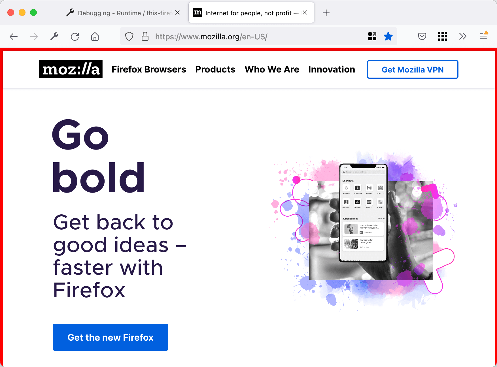

本文将从头到尾详细介绍如何为 Firefox 创建一个扩展。该扩展会在从 `mozilla.org` 或其任何子域名加载的页面上添加红色边框。

[此示例的源代码可在 GitHub 上找到](https://github.com/mdn/webextensions-examples/tree/main/borderify)。

## 编写扩展

在合适的位置，例如在 `Documents` 目录下，创建一个名为 `borderify` 的新目录，并导航到该目录。你可以使用计算机的文件资源管理器，或者使用命令行终端。

了解如何使用命令行终端是软件开发的一项实用技能。如果你需要入门终端的相关帮助，请查看[命令行速成课程](/zh-CN/docs/Learn_web_development/Getting_started/Environment_setup/Command_line)。

使用终端，你可以这样创建目录：

```bash
mkdir borderify
cd borderify
```

### manifest.json

使用合适的[文本编辑器](/zh-CN/docs/Learn_web_development/Howto/Tools_and_setup/Available_text_editors)，在“borderify”目录下直接创建一个名为“manifest.json”的文件。写入这些内容：

```json
{
  "manifest_version": 2,
  "name": "Borderify",
  "version": "1.0",

  "description": "给所有匹配 mozilla.org 的网页添加红色边框。",

  "icons": {
    "48": "icons/border-48.png"
  },

  "browser_specific_settings": {
    "gecko": {
      "id": "beastify@mozilla.org",
      "data_collection_permissions": {
        "required": ["none"]
      }
    }
  },

  "content_scripts": [
    {
      "matches": ["*://*.mozilla.org/*"],
      "js": ["borderify.js"]
    }
  ]
}
```

- 前三个键（[`manifest_version`](/zh-CN/docs/Mozilla/Add-ons/WebExtensions/manifest.json/manifest_version)、[`name`](/zh-CN/docs/Mozilla/Add-ons/WebExtensions/manifest.json/name) 和 [`version`](/zh-CN/docs/Mozilla/Add-ons/WebExtensions/manifest.json/version)）是必须的，包含有扩展的基本元数据。
- [`description`](/zh-CN/docs/Mozilla/Add-ons/WebExtensions/manifest.json/description) 对于 Safari 是必须的，而对于其他的则是可选的。但建议设置此属性，因为它将显示在浏览器的扩展管理器中（例如，Firefox 的 `about:addons`）。
- [`icons`](/zh-CN/docs/Mozilla/Add-ons/WebExtensions/manifest.json/icons) 是可选的，但建议设置：它允许你给扩展指定图标。
- [`browser_specific_settings`](/zh-CN/docs/Mozilla/Add-ons/WebExtensions/manifest.json/browser_specific_settings) 在 Firefox 中是必须的。
  - `gecko` 属性为 addons.mozilla.org 和 Firefox 提供了关于扩展的额外配置信息。
    - [`id`](/zh-CN/docs/Mozilla/Add-ons/WebExtensions/manifest.json/browser_specific_settings#id) 定义了扩展的唯一标识符。要在 addons.mozilla.org（AMO）上发布扩展，则必须声明此属性。
    - [`data_collection_permissions`](/zh-CN/docs/Mozilla/Add-ons/WebExtensions/manifest.json/browser_specific_settings#data_collection_permissions) 提供有关扩展是否收集和传输个人可识别信息的内容。要在 addons.mozilla.org（AMO）上发布扩展，则必须声明此属性。本示例不收集或传输任何数据。

到目前为止，`manifest.json` 的这些键已经提供了有关扩展的信息。下一个键——[`content_scripts`](/zh-CN/docs/Mozilla/Add-ons/WebExtensions/manifest.json/content_scripts)——开始定义扩展的功能。该键告诉 Firefox 加载脚本到其 URL 匹配特定模式的网页中。本例中，扩展要求 Firefox 加载脚本“borderify.js”到任何来自“mozilla.org”或其子域的 HTTP 或 HTTPS 页面。

- [了解更多关于内容脚本的内容。](/zh-CN/docs/Mozilla/Add-ons/WebExtensions/Content_scripts)
- [了解更多关于模式匹配的内容。](/zh-CN/docs/Mozilla/Add-ons/WebExtensions/Match_patterns)

### icons/border-48.png

Firefox 通过界面（例如工具栏和附加组件管理器——`about:addons`）中的图标来标识扩展。除非你提供了一个图标，否则 Firefox 会使用默认图标。随着你进入发布扩展的阶段，图标是用户识别你的扩展的一个有用方式。

此示例的 manifest.json 告诉 Firefox 图标位于“icons/border-48.png”。

在“borderify”目录下直接创建“icons”目录，并在“icons”目录下保存一个名为“border-48.png”的图标。你可以使用[示例中的图标](https://raw.githubusercontent.com/mdn/webextensions-examples/main/borderify/icons/border-48.png)，该图标来自谷歌 Material Design 图标库，遵循[署名—相同方式共享](https://creativecommons.org/licenses/by-sa/3.0/deed.zh-hans)协议。

如果你选择提供一个图标，它应该是 48×48 像素的。你也可以为高分辨率显示器提供一个 96x96 的像素图标，在 manifest.json 的 `icons` 对象中指定 `96` 属性即可，就像这样：

```json
"icons": {
  "48": "icons/border-48.png",
  "96": "icons/border-96.png"
}
```

或者，也可以在这里提供一个 SVG 文件，Firefox 会自动根据需要缩放。（不过：如果你正在使用 SVG 并且你的图标包含文字，你可能需要使用 SVG 编辑器的“转换为路径”工具来使文字扁平化，这样图标会以一个恒定的大小和位置来缩放。）

- [了解更多关于指定图标的内容。](/zh-CN/docs/Mozilla/Add-ons/WebExtensions/manifest.json/icons)

### borderify.js

最后，在“borderify”目录下创建“borderify.js”文件。写入下面的内容：

```js
document.body.style.border = "5px solid red";
```

Firefox 将脚本加载到与 manifest.json 文件中的 `content_scripts` 键给出的模式相匹配的页面中。该脚本可以直接访问文档，就像页面自身加载的脚本一样。

[了解更多关于内容脚本的内容。](/zh-CN/docs/Mozilla/Add-ons/WebExtensions/Content_scripts)

## 尝试一下

首先，仔细检查文件是否在正确的位置：

```plain
borderify/
    icons/
        border-48.png
    borderify.js
    manifest.json
```

### 安装

打开 Firefox 的 [about:debugging](https://firefox-source-docs.mozilla.org/devtools-user/about_colon_debugging/index.html) 页面，点击**此 Firefox**，点击**临时加载附加组件**按钮，并选择你的扩展所在的目录。

附加组件将会被安装，直到下次重启浏览器失效。

或者，你可以通过 [web-ext](https://extensionworkshop.com/documentation/develop/getting-started-with-web-ext/) 工具通过命令行来运行扩展。

### 测试

> [!NOTE]
> 默认情况下，[扩展在隐私浏览模式中不起作用](https://support.mozilla.org/zh-CN/kb/隐私浏览窗口中的扩展)。如果你想在隐私浏览模式中测试扩展，请打开 `about:addons`，点击拓展，然后选择在隐私窗口中运行的**允许**单选按钮。

现在，尝试访问 `https://www.mozilla.org/en-US/` 下的页面，你将看到页面边上有个红色的边框。



> [!NOTE]
> 但是，它不会在 `addons.mozilla.org` 上工作，因为该域名阻止了内容脚本。

不妨做些实验：编辑内容脚本，以更改边框颜色，或者对页面内容进行其他修改。保存内容脚本，然后点击 `about:debugging` 中的**重新加载**按钮，重新加载扩展程序的文件。你可以立即看到更改。

[了解更多关于加载扩展的信息。](https://extensionworkshop.com/documentation/develop/temporary-installation-in-firefox/)

## 打包和发布

为了给其他人使用你的插件，你需要打包，并将其提交给 Mozilla 进行签名。请参考[“发布你的扩展”](https://extensionworkshop.com/documentation/publish/package-your-extension/)，以了解更多内容。

## 下一步

现在，你已经在开发 Firefox 扩展的过程中得到了一些想法，尝试：

- [写一个更加复杂的扩展](/zh-CN/docs/Mozilla/Add-ons/WebExtensions/Your_second_WebExtension)
- [阅读更多关于扩展的内容](/zh-CN/docs/Mozilla/Add-ons/WebExtensions/Anatomy_of_a_WebExtension)
- [探索扩展的示例](/zh-CN/docs/Mozilla/Add-ons/WebExtensions/Examples)
- [了解开发、测试和发布扩展需要的知识](/zh-CN/docs/Mozilla/Add-ons/WebExtensions/What_next)
- [进一步学习](/zh-CN/docs/Mozilla/Add-ons/WebExtensions/What_next#继续你的学习经历)
