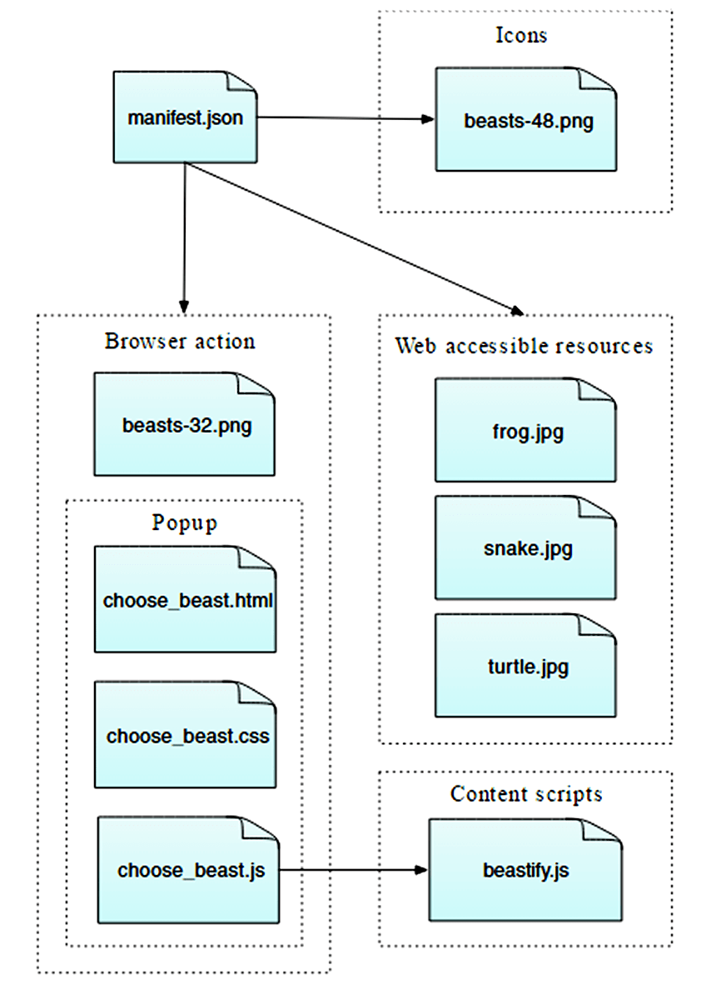
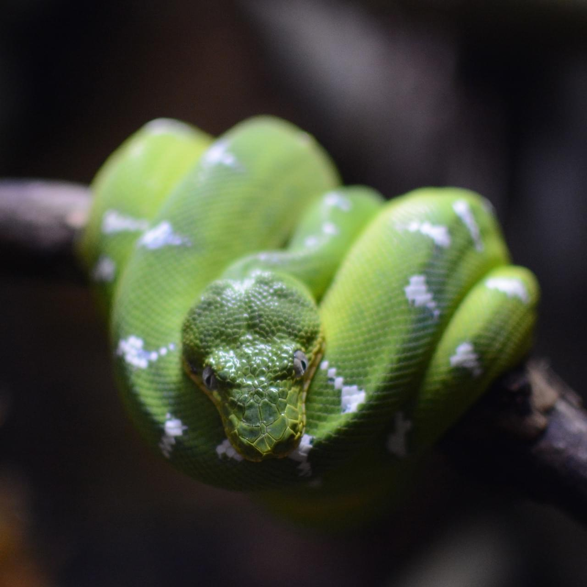
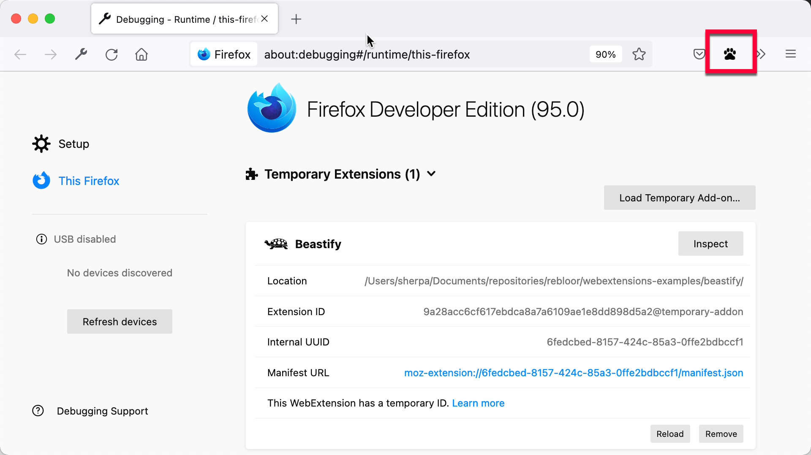
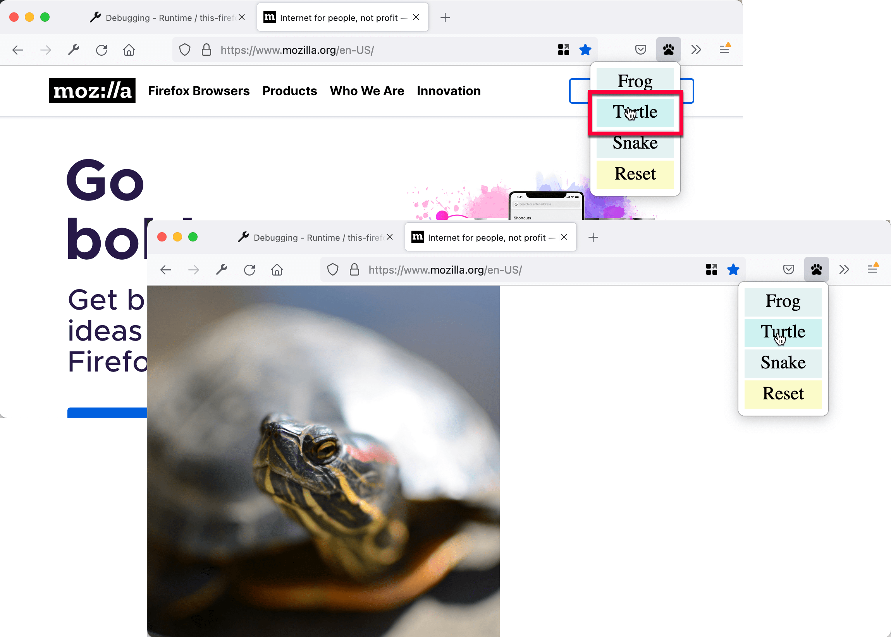

[你的第一个扩展](/zh-CN/docs/Mozilla/Add-ons/WebExtensions/Your_first_WebExtension)教程介绍了编写扩展程序的基本流程。在这篇文章，我们将编写一个更加复杂的扩展，以演示其他 API 的使用。

你开发的扩展演示了 Web 扩展 API 的许多基本概念，包括：

- 将按钮添加到工具栏。
- 使用 HTML、CSS 和 JavaScript 定义一个弹出框。
- 将内容脚本注入到网页。
- 内容脚本与扩展的其他部分之间的通信。
- 打包你的扩展的资源，使其可被网页所用。

该扩展会在 Firefox 工具栏中添加一个按钮。当用户点击该按钮时，扩展会显示让用户选择动物的弹出框。当用户选择动物时，扩展会将当前活动页面的内容替换成该动物的图片。

要实现这点，你需要：

- **定义一个 `action`，即一个附加到 Firefox 工具栏的[按钮](/zh-CN/docs/Mozilla/Add-ons/WebExtensions/user_interface/Toolbar_button)**。对于按钮，你需要提供：
  - 一个名为“beasts-32.png”的图标。
  - 用户按下按钮时要打开的弹出框。该弹出框将包含 HTML、CSS 和 JavaScript。

- **为扩展定义一个图标**，叫做“beasts-48.png”。附加组件管理器会在扩展程序的详细信息中显示此图标。
- **写一个内容脚本“beastify.js”，用于注入到网页中**。此代码会修改网页以添加或移除动物。
- **将一些动物图标打包为 Web 可访问资源**。这些图标被内容脚本更新的页面引用以显示动物。

你可以像这样形象地理解扩展的整体结构：



你可以[在 GitHub 上找到该扩展的完整的源代码](https://github.com/mdn/webextensions-examples/tree/main/beastify)。

## 编写扩展

创建一个目录，并导航到该目录：

```bash
mkdir beastify
cd beastify
```

### manifest.json

现在创建一个名为“manifest.json”的文件，并写入这些内容：

```json
{
  "description": "在工具栏添加一个动作图标。点击按钮选择一个动物。当前活动的标签页的内容会被替换成被选择动物的图片。参见 https://developer.mozilla.org/zh-CN/Add-ons/WebExtensions/Examples#beastify",
  "manifest_version": 3,
  "name": "Beastify",
  "version": "1.0",

  "homepage_url": "https://github.com/mdn/webextensions-examples/tree/main/beastify",
  "icons": {
    "48": "icons/beasts-48.png"
  },
  "permissions": ["activeTab", "scripting"],
  "browser_specific_settings": {
    "gecko": {
      "id": "beastify@mozilla.org",
      "data_collection_permissions": {
        "required": ["none"]
      }
    }
  },
  "action": {
    "default_icon": "icons/beasts-32.png",
    "theme_icons": [
      {
        "light": "icons/beasts-32-light.png",
        "dark": "icons/beasts-32.png",
        "size": 32
      }
    ],
    "default_title": "Beastify",
    "default_popup": "popup/choose_beast.html"
  },

  "web_accessible_resources": [
    {
      "resources": ["beasts/*.jpg"],
      "matches": ["*://*/*"]
    }
  ]
}
```

- 前三个键（[`manifest_version`](/zh-CN/docs/Mozilla/Add-ons/WebExtensions/manifest.json/manifest_version)、[`name`](/zh-CN/docs/Mozilla/Add-ons/WebExtensions/manifest.json/name) 和 [`version`](/zh-CN/docs/Mozilla/Add-ons/WebExtensions/manifest.json/version)）是必须的，包含有扩展的基本元数据。
- [`description`](/zh-CN/docs/Mozilla/Add-ons/WebExtensions/manifest.json/description) 对于 Safari 是必须的，而对于其他的则是可选的。但建议设置此属性，因为它将显示在浏览器的扩展管理器中（例如，Firefox 的 `about:addons`）。
- [`homepage_url`](/zh-CN/docs/Mozilla/Add-ons/WebExtensions/manifest.json/homepage_url) 是可选的，但建议设置：它提供了关于扩展的有用信息。
- [`icons`](/zh-CN/docs/Mozilla/Add-ons/WebExtensions/manifest.json/icons) 是可选的，但建议设置；它允许你给扩展指定一个图标。
- [`browser_specific_settings`](/zh-CN/docs/Mozilla/Add-ons/WebExtensions/manifest.json/browser_specific_settings) 是必须的。
  - `gecko` 属性为 addons.mozilla.org 和 Firefox 提供了关于扩展的额外配置信息：
  - [`id`](/zh-CN/docs/Mozilla/Add-ons/WebExtensions/manifest.json/browser_specific_settings#id) 定义了扩展的唯一标识符。要在 addons.mozilla.org（AMO）上发布扩展，则必须声明此属性。
  - [`data_collection_permissions`](/zh-CN/docs/Mozilla/Add-ons/WebExtensions/manifest.json/browser_specific_settings#data_collection_permissions) 提供有关扩展是否收集和传输个人可识别信息的内容。要在 addons.mozilla.org（AMO）上发布扩展，则必须声明此属性。本示例不收集或传输任何数据。
- [`permissions`](/zh-CN/docs/Mozilla/Add-ons/WebExtensions/manifest.json/permissions) 列出了扩展所需要的权限。在这个示例中，扩展需要 [`activeTab` 权限](/zh-CN/docs/Mozilla/Add-ons/WebExtensions/manifest.json/permissions#活动标签权限)。
- [`action`](/zh-CN/docs/Mozilla/Add-ons/WebExtensions/manifest.json/action) 指定了工具栏按钮。我们在这里提供了三项信息，所有信息均为可选项：
  - `default_icon` 指定了按钮的图标
  - `default_title` 提供操作按钮的工具提示文本。
  - `default_popup` 指向扩展程序自带的 HTML 文件，该文件定义了弹出窗口的内容。
- [`web_accessible_resources`](/zh-CN/docs/Mozilla/Add-ons/WebExtensions/manifest.json/web_accessible_resources) 列出了你想让网页可以访问的资源。由于扩展会将页面中的内容替换为我们随扩展打包的图像，你需要使这些图像可供页面访问。

需要注意，所有路径是相对于 manifest.json 文件的。

### 图标

扩展应该有一个图标。这个图标会显示在附加组件管理器（“about:addons”）的扩展列表的旁边。manifest.json 文件指定扩展的图标位于“icons/beasts-48.png”。

创建“icons”文件夹，并将图标命名为“beasts-48.png”。你可以使用[示例中的图标](https://raw.githubusercontent.com/mdn/webextensions-examples/main/beastify/icons/beasts-48.png)，它是从 [Aha-Soft 的免费 Retina 图标集](https://www.aha-soft.com/free-icons/free-retina-icon-set/)获取的，并根据其许可条款使用。

如果你选择提供一个图标，它应该是 48×48 像素的。你也可以为高分辨率显示器提供一个 96x96 的像素图标；将其指定为 manifest.json 的 `icons` 对象的 `96` 属性：

```json
"icons": {
  "48": "icons/beasts-48.png",
  "96": "icons/beasts-96.png"
}
```

### 工具栏按钮

工具栏按钮也需要一个图标，并且我们的 manifest.json 保证我们会在“icons/beasts-32.png”处放置工具栏的图标。

将一个图标命名为“beasts-32.png”并保存到“icons”文件夹。你可以使用[示例中的图片](https://raw.githubusercontent.com/mdn/webextensions-examples/main/beastify/icons/beasts-32.png)，它是取自 [IconBeast Lite 图标集](https://www.iconbeast.com/free/)并按其[许可](https://www.iconbeast.com/faq/)授权使用。

### 弹出框

如果你没有提供弹出框，用户点击工具栏的按钮时，Firefox 会直接向你的插件派发点击事件。如果你提供了弹出框，用户点击工具栏按钮会打开弹出框，Firefox 不会派发点击事件。

对于该示例，你需要一个弹出框。弹出框的功能是让用户选择三种动物的其中一种。

在扩展的根目录下创建“popup”文件夹。其用于存放弹出框的代码。弹出框由三个文件组成：

- `choose_beast.html` 定义了面板的内容。
- `choose_beast.css` 为内容添加样式。
- `choose_beast.js` 通过在当前活动的标签页中运行内容脚本处理用户的选择。

```bash
mkdir popup
cd popup
touch choose_beast.html choose_beast.css choose_beast.js
```

#### choose_beast.html

HTML 文件就像这样：

```html
<!doctype html>
<html lang="en-US">
  <head>
    <meta charset="utf-8" />
    <link rel="stylesheet" href="choose_beast.css" />
  </head>

  <body>
    <div id="popup-content">
      <button>Frog</button>
      <button>Turtle</button>
      <button>Snake</button>
      <button type="reset">Reset</button>
    </div>
    <div id="error-content" class="hidden">
      <p>Can't beastify this web page.</p>
      <p>Try a different page.</p>
    </div>
    <script src="choose_beast.js"></script>
  </body>
</html>
```

HTML 包含一个 ID 为 `"popup-content"` 的 [`<div>`](/zh-CN/docs/Web/HTML/Reference/Elements/div) 元素。其中包含了每个动物选择。另一个 `<div>` 元素的 ID 为 `"error-content"`，class 为 `"hidden"`。如果无法初始化弹出框，则扩展会使用第二个 `<div>`。

注意 HTML 从目录中引入了 CSS 和 JS 文件，就像网页一样。

#### choose_beast.css

CSS 固定了弹出框的大小，确保 3 个选择填充满空间，并为它们添加了基本的样式。同时隐藏了 `class="hidden"` 的元素，意味着扩展会默认隐藏 `<div id="error-content"...`。

```css
html,
body {
  width: 100px;
}

.hidden {
  display: none;
}

button {
  border: none;
  width: 100%;
  margin: 3% auto;
  padding: 4px;
  text-align: center;
  font-size: 1.5em;
  cursor: pointer;
  background-color: #e5f2f2;
}

button:hover {
  background-color: #cff2f2;
}

button[type="reset"] {
  background-color: #fbfbc9;
}

button[type="reset"]:hover {
  background-color: #eaea9d;
}
```

#### choose_beast.js

这里是弹出框的 JavaScript：

```js
/**
 * 用于隐藏页面上所有内容（除了具有“.beastify-image”类的元素）的 CSS。
 */
const hidePage = `body > :not(.beastify-image) {
                    display: none !important;
                  }`;

/**
 * 监听按钮上的点击事件，并向页面中的内容脚本发送适当的信息。
 */
function listenForClicks() {
  document.addEventListener("click", async (e) => {
    /**
     * 给定动物的名称，获取对应图像的 URL。
     */
    function beastNameToURL(beastName) {
      switch (beastName) {
        case "Frog":
          return browser.runtime.getURL("beasts/frog.jpg");
        case "Snake":
          return browser.runtime.getURL("beasts/snake.jpg");
        case "Turtle":
          return browser.runtime.getURL("beasts/turtle.jpg");
      }
    }

    /**
     * 将隐藏页面的 CSS 插入到活动标签页中，然后获取动物图片的
     * URL，并向活动标签页中的内容脚本发送“beastify”消息。
     */
    async function beastify(tab) {
      await browser.scripting.insertCSS({
        target: { tabId: tab.id },
        css: hidePage,
      });
      const url = beastNameToURL(e.target.textContent);
      await browser.tabs.sendMessage(tab.id, {
        command: "beastify",
        beastURL: url,
      });
    }

    /**
     * 移除活动标签页中隐藏页面的 CSS，并向活动标签页中的内容脚本发送“reset”消息。
     */
    async function reset(tab) {
      await browser.scripting.removeCSS({
        target: { tabId: tab.id },
        css: hidePage,
      });
      await browser.tabs.sendMessage(tab.id, { command: "reset" });
    }

    /**
     * 将错误记录到控制台。
     */
    function reportError(error) {
      console.error(`Could not beastify: ${error}`);
    }

    /**
     * 获取活动标签页，然后根据需要调用“beastify()”或“reset()”。
     */
    if (e.target.tagName !== "BUTTON" || !e.target.closest("#popup-content")) {
      // 当点击的是不在 <div id="popup-content"> 内的按钮时，忽略它。
      return;
    }

    try {
      const [tab] = await browser.tabs.query({
        active: true,
        currentWindow: true,
      });

      if (e.target.type === "reset") {
        await reset(tab);
      } else {
        await beastify(tab);
      }
    } catch (error) {
      reportError(error);
    }
  });
}

/**
 * 脚本执行过程中出现错误。显示弹出框的错误信息，并隐藏正常的 UI。
 */
function reportExecuteScriptError(error) {
  document.querySelector("#popup-content").classList.add("hidden");
  document.querySelector("#error-content").classList.remove("hidden");
  console.error(`Failed to execute beastify content script: ${error.message}`);
}

/**
 * 当弹出框加载时，将内容脚本注入到活动标签页中，并添加点击处理器。
 * 如果扩展无法注入脚本，则处理错误。
 */
(async function runOnPopupOpened() {
  try {
    const [tab] = await browser.tabs.query({
      active: true,
      currentWindow: true,
    });

    await browser.scripting.executeScript({
      target: { tabId: tab.id },
      files: ["/content_scripts/beastify.js"],
    });
    listenForClicks();
  } catch (e) {
    reportExecuteScriptError(e);
  }
})();
```

只要弹出框加载完，弹出框的脚本就会使用 [`browser.scripting.executeScript()`](/zh-CN/docs/Mozilla/Add-ons/WebExtensions/API/scripting/executeScript) API 在活动的标签页执行[内容脚本](#内容脚本)。如果内容脚本执行成功，页面会一直保持内容脚本的加载状态，直到标签被关闭或者用户导航到其他页面。

如果扩展程序无法在活动页面中执行内容脚本，则 `browser.scripting.executeScript()` 调用可能会失败。例如，扩展不能在（像 `about:debugging` 这样的）特权浏览器页面执行，也不能在 [addons.mozilla.org](https://addons.mozilla.org/) 域的页面中执行。如果调用失败，`reportExecuteScriptError()` 会隐藏 `<div id="popup-content">` 元素，并展示 `<div id="error-content"...` 元素，然后在[控制台](https://extensionworkshop.com/documentation/develop/debugging/)中打印错误。

如果成功执行内容脚本，代码会调用 `listenForClicks()`。它监听了弹出框的点击事件。然后：

- 如果点击不在弹出框的按钮上，会忽略它且不做任何事情。
- 如果点击有 `class="reset"` 的按钮，代码会调用 `reset()`。
- 如果点击有 `class="beast"`的按钮（即动物按钮），代码会调用 `beastify()`。

`beastify()` 函数做了三件事：

- 将被点击的按钮映射到一个指向特定动物图片的 URL。
- 通过 [`browser.scripting.insertCSS()`](/zh-CN/docs/Mozilla/Add-ons/WebExtensions/API/scripting/insertCSS) API 向页面注入一些 CSS 来隐藏整个页面的内容。
- 通过 [`browser.tabs.sendMessage()`](/zh-CN/docs/Mozilla/Add-ons/WebExtensions/API/tabs/sendMessage) API 向内容脚本发送“beastify”消息，向其传递一个指向动物图片的 URL，以要求其展示动物页面。

`reset()` 函数实际上就是撤销动物展示。它：

- 通过 [`browser.scripting.removeCSS()`](/zh-CN/docs/Mozilla/Add-ons/WebExtensions/API/scripting/removeCSS) API 移除我们添加的 CSS。
- 向内容脚本发送“reset”消息，要求其重置页面。

### 内容脚本

在扩展的根目录下创建一个新的文件夹，叫做“content_scripts”，然后在里面新建一个新的名为“beastify.js”的文件，并写入这些内容：

```js
(function () {
  /**
   * 检查并设置全局哨兵变量，以确保如果这个内容脚本再次被注入到同一页面，它将返回（且不再执行任何操作）。
   */
  if (window.hasRun) {
    return;
  }
  window.hasRun = true;

  /**
   * 给定一个指向动物图片的 URL，移除所有现有的动物，
   * 然后创建并设置一个指向该图片的 IMG 节点，并将该节点插入到文档中。
   */
  function insertBeast(beastURL) {
    removeExistingBeasts();
    let beastImage = document.createElement("img");
    beastImage.setAttribute("src", beastURL);
    beastImage.style.objectFit = "contain";
    beastImage.style.position = "fixed";
    beastImage.style.height = "100%";
    beastImage.style.width = "100%";
    beastImage.className = "beastify-image";
    document.body.appendChild(beastImage);
  }

  /**
   * 移除页面中的所有动物。
   */
  function removeExistingBeasts() {
    let existingBeasts = document.querySelectorAll(".beastify-image");
    for (let beast of existingBeasts) {
      beast.remove();
    }
  }

  /**
   * 监听来自后台脚本的消息。
   * 根据消息，调用“beastify()”或“reset()”。
   */
  browser.runtime.onMessage.addListener((message) => {
    if (message.command === "beastify") {
      insertBeast(message.beastURL);
    } else if (message.command === "reset") {
      removeExistingBeasts();
    }
  });
})();
```

内容脚本做的第一件事是检查全局变量 `window.hasRun`：如果它被设置了，脚本直接返回；否则设置 `window.hasRun` 并继续。原因是每次用户打开弹出框，弹出框就会在活动页面执行一次内容脚本，所以扩展可能会在单个标签页运行多个脚本实例。如果是这样的话，代码需要保证只有第一个实例执行操作。

然后内容脚本使用 [`browser.runtime.onMessage`](/zh-CN/docs/Mozilla/Add-ons/WebExtensions/API/runtime/onMessage) API 监听来自弹出框的消息。你之前已经看到，弹出框脚本能够发送两种不同的消息：“beastify”和“reset”。

- 如果消息是“beastify”，代码预期其中包含一个指向动物图片的 URL。扩展移除先前调用添加的动物图片，然后构造并添加一个 `src` 属性被设置动物图片 URL 的 [``](/zh-CN/docs/Web/HTML/Reference/Elements/img) 元素。
- 如果消息是“reset”，扩展要移除所有被添加的动物图片。

### 动物

最后，你需要加入包含动物的图像。

创建“beasts”文件夹，之后将图片放入并命名。你可以从 [GitHub 仓库](https://github.com/mdn/webextensions-examples/tree/main/beastify/beasts)或这里下载图片：





## 测试

首先，请仔细检查你是否已将正确的文件放在正确的位置：

```plain
beastify/

    beasts/
        frog.jpg
        snake.jpg
        turtle.jpg

    content_scripts/
        beastify.js

    icons/
        beasts-32.png
        beasts-48.png

    popup/
        choose_beast.css
        choose_beast.html
        choose_beast.js

    manifest.json
```

现在，以临时附加组件的形式加载扩展。在 Firefox 中打开 `about:debugging`，点击**此 Firefox** 然后点击**临时加载附加组件**，选择你的 manifest.json 文件。然后你应该可以在 Firefox 的工具栏中看到扩展的图标：



打开一个网页，然后点击图标，选择一个动物，然后观察网页的变化：



## 用命令行开发

你可以通过使用 [`web-ext`](https://extensionworkshop.com/documentation/develop/getting-started-with-web-ext/) 工具来将临时安装的工作自动化。在安装 `web-ext` 后，试试这个：

```bash
cd beastify
web-ext run
```

## 下一步

你已经创建了一个更加高级的 Firefox 扩展，接下来可以：

- [了解扩展的结构](/zh-CN/docs/Mozilla/Add-ons/WebExtensions/Anatomy_of_a_WebExtension)
- [探索扩展的示例](/zh-CN/docs/Mozilla/Add-ons/WebExtensions/Examples)
- [了解开发、测试和发布扩展需要的知识](/zh-CN/docs/Mozilla/Add-ons/WebExtensions/What_next)
- [进一步学习](/zh-CN/docs/Mozilla/Add-ons/WebExtensions/What_next#继续你的学习经历)。
