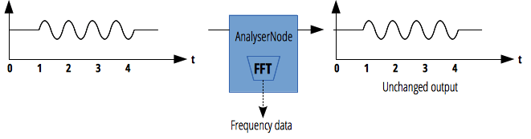

{{APIRef("Web Audio API")}}

**`AnalyserNode`** 接口表示了一个可以提供实时频域和时域分析信息的节点。它是一个不对音频流作任何改动的 {{domxref("AudioNode")}}，同时允许你获取和处理它生成的数据，从而创建音频可视化。

`AnalyzerNode` 只有一个输入和输出，即使未连接到输出它也能正常工作。



<table class="properties">
  <tbody>
    <tr>
      <th scope="row">输入数</th>
      <td><code>1</code></td>
    </tr>
    <tr>
      <th scope="row">输出数</th>
      <td><code>1</code> (但可能是未连接的)</td>
    </tr>
    <tr>
      <th scope="row">通道计数模式</th>
      <td><code>"explicit"</code></td>
    </tr>
    <tr>
      <th scope="row">通道数</th>
      <td><code>1</code></td>
    </tr>
    <tr>
      <th scope="row">通道解释</th>
      <td><code>"speakers"</code></td>
    </tr>
  </tbody>
</table>

## 继承

继承自以下父接口：

{{InheritanceDiagram}}

## 构造函数

- {{domxref("AnalyserNode.AnalyserNode", "AnalyserNode()")}}
  - : 创建一个新的 `AnalyserNode` 对象实例。

## 属性

_继承属性自_ _{{domxref("AudioNode")}}。_

- {{domxref("AnalyserNode.fftSize")}}
  - : 一个无符号长整形 (unsigned long) 的值，代表了用于计算频域信号时使用的 FFT ([快速傅里叶变换](https://zh.wikipedia.org/zh-cn/%E5%BF%AB%E9%80%9F%E5%82%85%E9%87%8C%E5%8F%B6%E5%8F%98%E6%8D%A2)) 的窗口大小。
- {{domxref("AnalyserNode.frequencyBinCount")}} {{readonlyInline}}
  - : 一个无符号长整形 (unsigned long) 的值，值为 fftSize 的一半。这通常等于将要用于可视化的数据值的数量。
- {{domxref("AnalyserNode.minDecibels")}}
  - : 是一个双精度值，表示 FFT 分析频域数据并转换为无符号字节值时，对输入的功率数据的最小阈值 - 基本上，它限定了调用`getByteFrequencyData()`时结果范围的最小值
- {{domxref("AnalyserNode.maxDecibels")}}

  - : 是一个双精度值，表示 FFT 分析频域数据并转换为无符号字节值时，对输入的功率数据的最大阈值 - 基本上，它限定了调用`getByteFrequencyData()`时结果范围的最大值

- {{domxref("AnalyserNode.smoothingTimeConstant")}}
  - : 是一个双精度浮点型 (double) 的值，表示最后一个分析帧的平均常数 — 基本上，它随时间使值之间的过渡更平滑。

## 方法

_继承方法自_ _{{domxref("AudioNode")}}_.

- {{domxref("AnalyserNode.getFloatFrequencyData()")}}
  - : 将当前频域数据拷贝进{{domxref("Float32Array")}}数组。
- {{domxref("AnalyserNode.getByteFrequencyData()")}}
  - : 将当前频域数据拷贝进{{domxref("Uint8Array")}}数组（无符号字节数组）。
- {{domxref("AnalyserNode.getFloatTimeDomainData()")}}
  - : 将当前波形，或者时域数据拷贝进{{domxref("Float32Array")}}数组。
- {{domxref("AnalyserNode.getByteTimeDomainData()")}}
  - : 将当前波形，或者时域数据拷贝进 {{domxref("Uint8Array")}}数组（无符号字节数组）。

## 例子

> **备注：** 查看 [Visualizations with Web Audio API](/zh-CN/docs/Web/API/Web_Audio_API/Visualizations_with_Web_Audio_API) 指南以获得更多关于创建音频可视化效果的信息。

### 基础用法

下面的例子展示了 {{domxref("AudioContext")}} 创建一个 `AnalyserNode`, 然后用 {{domxref("window.requestAnimationFrame()","requestAnimationFrame")}} 和 {{htmlelement("canvas")}} 去反复收集当前音频的时域数据，并绘制为一个示波器风格的输出 (频谱).

更多的例子/信息，查看 [Voice-change-O-matic](https://mdn.github.io/voice-change-o-matic/) 演示 (相关代码在 [app.js 的 128 行\~205 行](https://github.com/mdn/voice-change-o-matic/blob/gh-pages/scripts/app.js#L128-L205)).

```js
var audioCtx = new (window.AudioContext || window.webkitAudioContext)();
var analyser = audioCtx.createAnalyser();

// ...

analyser.fftSize = 2048;
var bufferLength = analyser.frequencyBinCount;
var dataArray = new Uint8Array(bufferLength);
analyser.getByteTimeDomainData(dataArray);

// 获取 ID 为 "oscilloscope" 的画布
var canvas = document.getElementById("oscilloscope");
var canvasCtx = canvas.getContext("2d");

// 绘制一个当前音频源的示波器

function draw() {
  drawVisual = requestAnimationFrame(draw);

  analyser.getByteTimeDomainData(dataArray);

  canvasCtx.fillStyle = "rgb(200, 200, 200)";
  canvasCtx.fillRect(0, 0, canvas.width, canvas.height);

  canvasCtx.lineWidth = 2;
  canvasCtx.strokeStyle = "rgb(0, 0, 0)";

  canvasCtx.beginPath();

  var sliceWidth = (canvas.width * 1.0) / bufferLength;
  var x = 0;

  for (var i = 0; i < bufferLength; i++) {
    var v = dataArray[i] / 128.0;
    var y = (v * canvas.height) / 2;

    if (i === 0) {
      canvasCtx.moveTo(x, y);
    } else {
      canvasCtx.lineTo(x, y);
    }

    x += sliceWidth;
  }

  canvasCtx.lineTo(canvas.width, canvas.height / 2);
  canvasCtx.stroke();
}

draw();
```

## 规范

{{Specifications}}

## 浏览器兼容性

{{Compat}}

## 相关内容

- [Web Audio API 的运用](/zh-CN/docs/Web_Audio_API/Using_Web_Audio_API)
