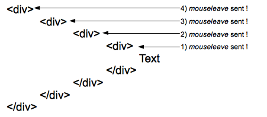
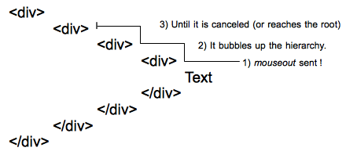

{{APIRef("UI Events")}}

**`mouseleave`** 事件在定点设备（通常是鼠标）的光标移出 {{domxref("Element")}} 时，会在该元素上触发。

`mouseleave` 与 {{domxref("Element/mouseout_event", "mouseout")}} 相似，但区别在于 `mouseleave` 不会冒泡，而 `mouseout` 会冒泡。这意味着当指针已离开该元素*及其*所有后代时，会触发 `mouseleave`；而由于冒泡，当指针离开该元素*或*离开该元素的某个后代时（即使指针仍在该元素内），也会触发 `mouseout`。除此之外，在同一情形下，leave 与 out 事件会在适当时同时派发。

当元素被替换或从 DOM 中移除时，不会触发 `mouseleave` 和 `mouseout` 事件。

请注意，「移出某个元素」指的是元素在 DOM 树中的位置，而不是其视觉位置。例如，若两个兄弟元素的定位使其中一个位于另一个内部，则从外部元素移入内部元素会在外部元素上触发 `mouseleave`，即使指针仍位于外部元素的边界内。

## 语法

在诸如 {{domxref("EventTarget.addEventListener", "addEventListener()")}} 等方法中使用事件名称，或设置事件处理器属性。

```js-nolint
addEventListener("mouseleave", (event) => { })

onmouseleave = (event) => { }
```

## 事件类型

{{domxref("MouseEvent")}}。继承自 {{domxref("UIEvent")}} 和 {{domxref("Event")}}。

{{InheritanceDiagram("MouseEvent")}}

## 描述

### `mouseleave` 事件的行为



离开层次结构中的各个元素时，会向每个元素发送一个 `mouseleave` 事件。此处，当指针从文本移到图中最外层 div 之外的区域时，会向层次结构中的四个元素发送四个事件。

### `mouseout` 事件的行为



单个 `mouseout` 事件会发送到 DOM 树中最深的元素，然后沿层次结构向上冒泡，直到被处理器取消或到达根元素。

## 示例

[`mouseout`](/zh-CN/docs/Web/API/Element/mouseout_event#示例) 文档中有一个示例，说明了 `mouseout` 与 `mouseleave` 的区别。

### mouseleave

以下简单示例使用 `mouseenter` 事件，在鼠标进入分配给 `<div>` 的区域时更改其边框。然后向列表添加一项，并带上 `mouseenter` 或 `mouseleave` 事件的编号。

#### HTML

```html
<div id="mouseTarget">
  <ul id="unorderedList">
    <li>还没有事件！</li>
  </ul>
</div>
```

#### CSS

为 `<div>` 添加样式，使其更易辨认。

```css
#mouseTarget {
  box-sizing: border-box;
  width: 15rem;
  border: 1px solid #333333;
}
```

#### JavaScript

```js
let enterEventCount = 0;
let leaveEventCount = 0;
const mouseTarget = document.getElementById("mouseTarget");
const unorderedList = document.getElementById("unorderedList");

mouseTarget.addEventListener("mouseenter", (e) => {
  mouseTarget.style.border = "5px dotted orange";
  enterEventCount++;
  addListItem(`这是 mouseenter 事件 ${enterEventCount}。`);
});

mouseTarget.addEventListener("mouseleave", (e) => {
  mouseTarget.style.border = "1px solid #333333";
  leaveEventCount++;
  addListItem(`这是 mouseleave 事件 ${leaveEventCount}。`);
});

function addListItem(text) {
  // 使用提供的文本创建一个新的文本节点
  const newTextNode = document.createTextNode(text);

  // 创建一个新的 li 元素
  const newListItem = document.createElement("li");

  // 将文本节点添加到 li 元素
  newListItem.appendChild(newTextNode);

  // 将新创建的列表项添加到列表
  unorderedList.appendChild(newListItem);
}
```

#### 结果

{{EmbedLiveSample('mouseleave')}}

## 规范

{{Specifications}}

## 浏览器兼容性

{{Compat}}

## 参见

- [学习：事件介绍](/zh-CN/docs/Learn_web_development/Core/Scripting/Events)
- {{domxref("Element/mousedown_event", "mousedown")}}
- {{domxref("Element/mouseup_event", "mouseup")}}
- {{domxref("Element/mousemove_event", "mousemove")}}
- {{domxref("Element/click_event", "click")}}
- {{domxref("Element/dblclick_event", "dblclick")}}
- {{domxref("Element/mouseover_event", "mouseover")}}
- {{domxref("Element/mouseout_event", "mouseout")}}
- {{domxref("Element/mouseenter_event", "mouseenter")}}
- {{domxref("Element/contextmenu_event", "contextmenu")}}
- {{domxref("Element/pointerleave_event", "pointerleave")}}
