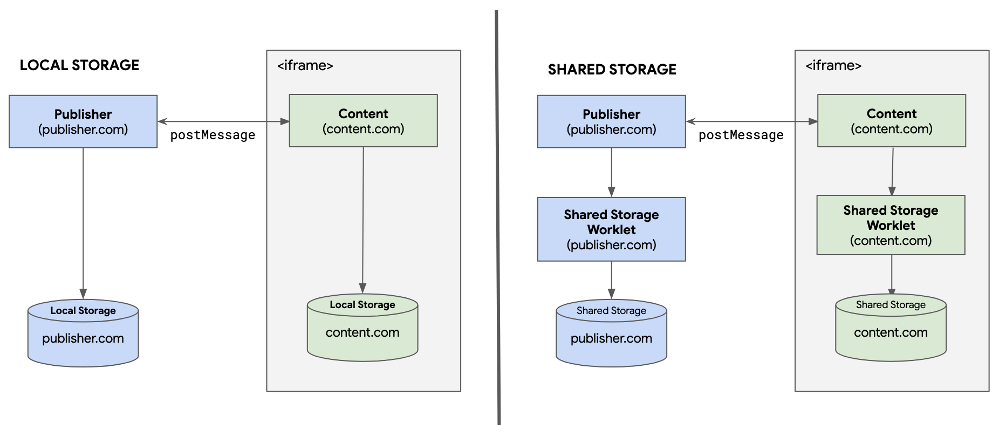
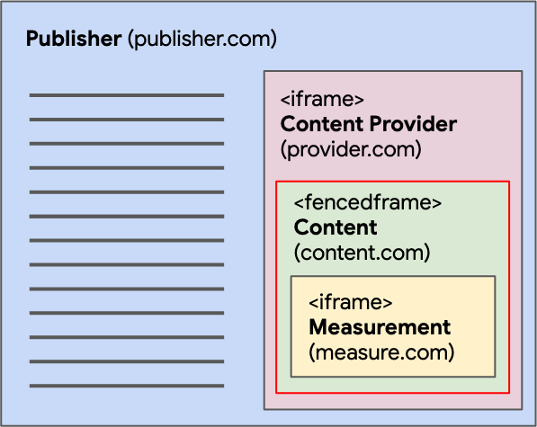
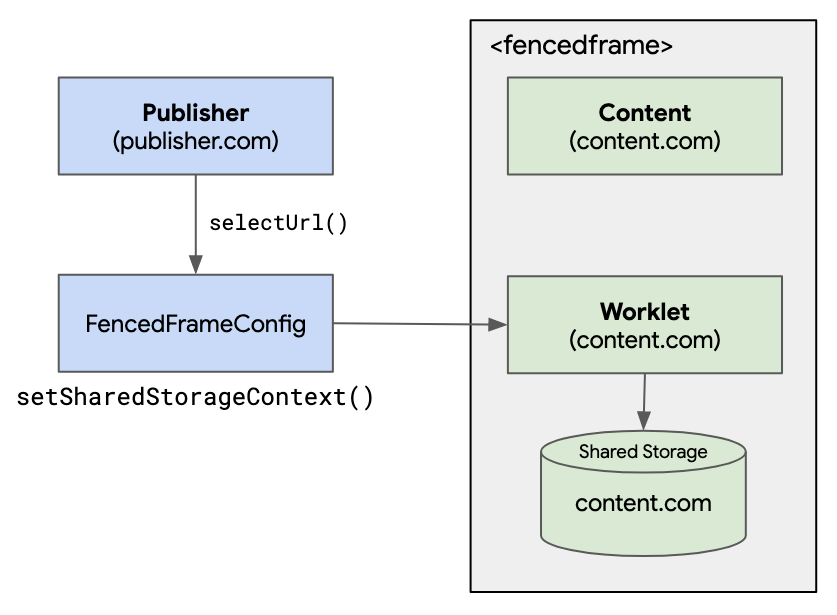

{{DefaultAPISidebar("Fenced Frame API")}}

本文提供关于嵌入器与嵌入不同类型框架（即 {{htmlelement("iframe")}} 和 {{htmlelement("fencedframe")}}）中的内容之间的通信方式有何不同以及传递的数据如何存储的信息。

## 如何在嵌入器与 `<iframe>` 之间进行通信



当第三方代码被嵌入到 `<iframe>` 中时，`<iframe>` 和嵌入器可以自由地相互发送消息，将请求数据写入它们的客户端[共享存储](/zh-CN/docs/Web/API/Shared_Storage_API)中。嵌入器可以通过跨文档通信通道使用 {{domxref("Window.postMessage()")}} 向该 `<iframe>` 发送请求，以将数据写入其自身的第三方存储中。第三方也可以通过发送 `postMessage()` 请求与嵌入器进行通信。

在 `<iframe>` 中，你可以监听来自嵌入器的 [message](/zh-CN/docs/Web/API/Window/message_event) 事件。当嵌入器使用 `postMessage()` 向 `<iframe>` 发送消息时，`<iframe>` 可以接收这些数据并将其存储在自身的客户端共享存储中。相反，`<iframe>` 也可以发送一条消息，嵌入器可以监听这条消息，并通过将数据写入其共享存储来做出响应。

## 如何在嵌入器与 `<fencedframe>` 之间进行通信

围栏框架（Fenced frames）旨在用于诸如通过[受保护的受众 API](https://developers.google.cn/privacy-sandbox/private-advertising/protected-audience) 和 {{domxref("WindowSharedStorage.selectURL()")}} 选择并展示定向广告等场景。页面上的 `<fencedframe>` 与 `<fencedframe>` 外部的其他页面之间的通信是故意受到限制的，但存在一种嵌入器与共享存储工作线程之间的通信方法——{{domxref("FencedFrameConfig.setSharedStorageContext()")}}。

> [!NOTE]
> 在同一个 `<fencedframe>` 树结构中，允许各框架之间进行通信。例如，根 `<fencedframe>` 可以向其自己树结构中的一个子 `<iframe>` 发送消息，而一个子 `<iframe>` 也可以向父 `<fencedframe>` 发送消息。

让我们来看一个更复杂的例子，使用 `selectURL` 输出门操作（gate operation）来在 `<fencedframe>` 中渲染广告。



在这个例子中，发布商（Publisher）请求第三方内容提供商（Content Provider）在页面上渲染一些内容（Content）。使用 {{domxref("WindowSharedStorage.selectURL()")}} 选择的内容将在 `<fencedframe>` 中渲染，并且该内容包含一个来自测量提供商（Measurement）的 `<iframe>`。请注意，发布商可以代表任何嵌入第三方 `<fencedframe>` 的实体。同样，测量提供商代表在任何不同第三方的 `<fencedframe>` 中运行的任何嵌套第三方代码。

为了将数据传递到 `<fencedframe>` 中以便在共享存储工作线程中使用，嵌入器可以在 {{domxref("FencedFrameConfig")}} 中设置数据。该值将在共享存储工作线程内部作为 {{domxref("WorkletSharedStorage.context")}} 提供。此数据在工作线程外部不可用，并且只能在共享存储工作线程提供的安全和私密环境中访问。



当 `selectURL()` 调用返回 `FencedFrameConfig` 时，框架嵌入器可以通过调用 `setSharedStorageContext(data)` 传递数据：

```js
const fencedFrameConfig = await window.sharedStorage.selectURL(
  "creative-rotation",
  urls,
  {
    // …
    resolveToConfig: true,
  },
);

fencedFrameConfig.setSharedStorageContext("some-data");

// 导航至配置所指定的围栏框架。
document.getElementById("my-fenced-frame").config = fencedFrameConfig;
```

必须在将预期的 `<fencedframe>` 元素接收者的 `config` 属性设置为 `fencedFrameConfig` 之前，在 `fencedFrameConfig` 上调用 `setSharedStorageContext(data)`，因为这会触发框架的导航。

在共享存储工作线程内部，可以访问 `WorkletSharedStorage.context` 来检索该数据：

```js
class ReportingOperation {
  async run() {
    sharedStorage.set("some-data-from-embedder", sharedStorage.context);
  }
}
register("send-report", ReportingOperation);
```
