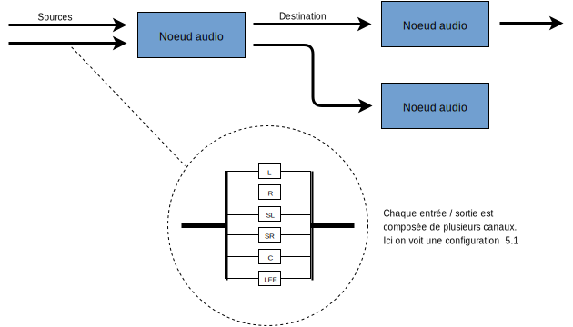
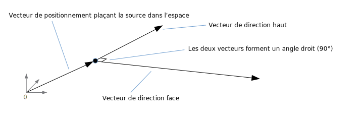

这篇文章解释了 网页音频接口 (Web Audio API) 运作过程中的部分音频处理概念。本文并不会将你变为一名音频处理大师，但它可以给你足够的背景知识来理解 网页音频接口 的运行原理，并能让你在使用它时做出更好的决策。

## 音频节点：模块化连接

网页音频接口 (Web Audio API) 主要在 **音频环境 (audio context)** 中进行音频处理，它也允许模块间的连接。基本的音频处理在 **音频节点 (audio node)** 当中进行，这些节点连接在一起形成了 **音频导向图 (audio routing graph)**。多个声源，甚至包含不同种类的声道，都可以在一个音频环境中进行处理。这种模块化的设计使得人们在创建复杂多变的声音特效时可以更加灵活。

音频节点可以通过各自的输入与输出相连，形成一个 从一个或多个声源开始，经过处理节点，终止于末节点 的链式结构（有时你不需要末节点，比如你只是想数字化处理某些音频数据的时候）。一个简单、典型的网页音频接口的操作流程可以是这样的：

1. 创建一个音频环境
2. 在音频环境中，创建声源——例如{{HTMLElement("audio")}} 标签，振动发声器 (oscillator)，音频流
3. 创建特效节点——例如混响，双二阶滤波，声相控制，音频振幅压缩
4. 选择音频的终点——例如系统的扬声器
5. 连接声源和特效，以及特效和终点。


每个输入和输出都可以包括几个声道，声道代表了一个特定的音效通道。各种声道分离结构都可以使用，包括*单声道*，_立体声_，_四声道_，*5.1*等等。



声源可以来自不同的地方：

- 直接通过 Javascript 生成声音节点产生（例如一个振动发声器）
- 由脉冲编码调制产生的原始数据（音频环境中可以调用一些方法来解码部分支持的格式）
- 从 HTML 元素中（例如 {{HTMLElement("video")}} 或者 {{HTMLElement("audio")}} 标签）
- 直接通过一个 [WebRTC](/zh-CN/docs/WebRTC) {{domxref("MediaStream")}} 获取流媒体（例如一个摄像头或麦克风）

## 音频数据：什么是样本

当一个音频信号被处理时，取样意味着从一个[连续的信号](http://wikipedia.org/wiki/Continuous_signal)转化为[离散的信号](http://wikipedia.org/wiki/Discrete_signal)；更具体地说，一个连续的声波（例如一个正在演奏的乐队发出的声音）会被转化成一系列的样本点（一个时间上离散的信号），计算机只可以处理这些离散的样本块。

更多的细节可以查看维基百科的[采样](http://wikipedia.org/wiki/Sampling_%28signal_processing%29)页面。

## 音频片段：帧、样本和声道

一个 音频片段 ({{ domxref("AudioBuffer") }}) 会包含几个组成参数：一个或几个声道（1 代表*单声道*，2 代表*立体声*等等），一个长度（代表片段中采样帧的数目）和一个采样率（是每秒钟采样帧的个数）。

每个样本点都是一个 代表着该音频流在特定时间特定声道上的数值的 单精度浮点数。一个帧，或者一个采样帧是由一组在特定时间上的所有声道的样本点组成的——即所有声道在同一时间的样本点（*立体声*有 2 个，*5.1*有 6 个，等等，每个帧包含的样本点个数和声道数相同）。

采样率就是一秒钟内获取帧的个数，单位是赫兹 (Hz)。采样率越高，音频效果越好。

现在让我们来看一下通道，一个单声道和一个立体声的音频片段，每个都是 1 秒钟，播放频率（采样率）为 44100 赫兹：

- 单声道片段会有 44100 个样本点和 44100 个帧。长度属性为 44100。
- 立体声片段会有 88200 个样本点和 44100 个帧。长度属性依旧为 44100，因为长度总和帧的个数相同。


当一个音频片段开始播放时，你将会听到最左侧的样本帧，之后是他右侧相邻的一帧，以此类推。在立体声中，你将会同时听到两个声道。样本帧的概念在此时非常有用，因为每个样本帧代表特定的播放时间，而和声道个数无关，这种方式很有利于精确的多声道同步处理。

> **备注：** 只需用帧的数目除以采样率即可得到播放时间（单位为秒）。用样本点数目除以声道个数即可得到帧的数目。

下面我们将展示几个浅显易懂的示例：

```js
var context = new AudioContext();
var buffer = context.createBuffer(2, 22050, 44100);
```

如果你使用上面的方法调用，你将会得到一个立体声（两个声道）的音频片段 (Buffer)，当它在一个频率为 44100 赫兹（这是目前大部分声卡处理声音的频率）的音频环境中播放的时候，会持续 0.5 秒：22050 帧 / 44100 赫兹 = 0.5 秒。

> **备注：** 在 [数字音频](https://zh.wikipedia.org/zh-cn/數位音訊) 中，**44,100 [赫兹](https://wikipedia.org/wiki/Hertz)** （有时也写作 **44.1 kHz**）是一个常见的 [取样频率](https://wikipedia.org/wiki/Sampling_frequency)。为什么选取 44.1kHz 呢？首先，因为 [人耳的接收频率](https://wikipedia.org/wiki/Hearing_range) 大约在 20 Hz 到 20,000 Hz 之间，根据 [采样定理](https://zh.wikipedia.org/wiki/采样定理)，采样频率一定要大于最终生成数据最大频率的二倍，因此就一定要大于 40,000 Hz（即 40kHz）。不仅如此，在采样之前信号还必须通过 [低通滤波器](https://zh.wikipedia.org/zh-cn/低通滤波器) ，否则 会发生[混叠](https://zh.wikipedia.org/zh-cn/混疊)现象，一个理想低通滤波器会完全留下低于 20kHz 的信号（且没有使它衰减）并完美阻拦一切高于 20kHz 的信号，而事实上 [过度频带（英文）](https://wikipedia.org/wiki/Transition_band)总是存在，在这个区域内信号会被部分衰减。这个频带越宽，建立一个 [抗混叠滤波器](https://zh.wikipedia.org/zh-cn/抗混疊濾波器) 才越容易。因此我们选取 44.1kHz 允许我们有 2.05kHz 的空间预留给过度频带。

```js
var context = new AudioContext();
var buffer = context.createBuffer(1, 22050, 22050);
```

如果你这样调用，你将会得到一个单声道的音频片段 (Buffer)，当它在一个频率为 44100 赫兹的音频环境中播放的时候，将会被自动按照 44100 赫兹*重采样*（因此也会转化为 44100 赫兹的片段），并持续 1 秒：44100 帧 / 44100 赫兹 = 1 秒。

> **备注：** 音频重采样与图片的缩放非常类似：比如你有一个 16 x 16 的图像，但是你想把它填充到一个 32 x 32 大小的区域，你就要对它进行缩放（重采样）。得到的结果会是一个较低品质的（图像会模糊或者有锯齿形的边缘，这取决于缩放采用的算法），但它却是能将原图形缩放，并且缩放后的图像占用空间比相同大小的普通图像要小。重新采样的音频道理相同——你会节约一些空间，但事实上你无法产出高频率的声音（高音区）。

### 分离式与交错式音频片段

网页音频接口使用了分离式的片段储存方式：左 (L) 右 (R) 声道像这样存储：

```
LLLLLLLLLLLLLLLLRRRRRRRRRRRRRRRR（对于一个有 16 帧的音频片段）
```

这种储存方式在音频处理中非常常见：这种方式允许对每个声道单独处理。

另一种储存方式是使用交错式的片段储存方式：

```
LRLRLRLRLRLRLRLRLRLRLRLRLRLRLRLR（对于一个有 16 帧的音频片段）
```

这种方式在存储以及播放音频等不需要音频加工的操作中非常常见，例如一个解码后的 MP3 流媒体。

在开发者接触到的网页音频接口中**只有**分离式音频片段，因为它主要用于音频加工。在处理过程中它使用分离式，但是当它传送到声卡中用于播放时，音频片段会被转化为交错式。反过来，当 MP3 被解码时，初始状态它是交错式的，但是他会被转化成分离式以用于音频加工。

## 声道

不同的音频片段可能包含不同数量的声道个数，从基本的*单声道*（只有一个声道），_立体声_（左右两个声道），到更加复杂的*四声道*，_5.1_。由于每个声道中包含的音频数据可以不同，因此声道越多听觉效果越好。在不同声道模式中，表示特定声道的缩写如下表所示：

| _单声道_ | `0: M: 唯一声道`                                                          | _Mono_   | `0: M: mono`                                                                                       |
| -------- | ------------------------------------------------------------------------- | -------- | -------------------------------------------------------------------------------------------------- |
| _立体声_ | `0: L: 左 1: R: 右`                                                       | _Stereo_ | `0: L: left 1: R: right`                                                                           |
| _四声道_ | `0: L: 左 1: R: 右 2: SL: 环绕左 3: SR: 环绕右`                           | _Quad_   | `0: L: left 1: R: right 2: SL: surround left 3: SR: surround right`                                |
| _5.1_    | `0: L: 左 1: R: 右 2: C: 中央 3: LFE: 低音炮 4: SL: 环绕左 5: SR: 环绕右` | _5.1_    | `0: L: left 1: R: right 2: C: center 3: LFE: subwoofer 4: SL: surround left 5: SR: surround right` |

> **备注：** 由于缩写来自英文，因此保留英文作对照。

### 向上和向下混频

当输入与输出的声道数不同时，我们就需要按照如下方法进行混频。这些封装好的方法可以通过设置声音节点的 {{domxref("AudioNode.channelInterpretation")}} 属性为 `"speakers"`（扬声器）或 `"discrete"`（离散声道）进行混频。

<table class="no-markdown">
  <thead>
    <tr>
      <th scope="row">混频方式 (Interpretation)</th>
      <th scope="col">输入声道模式</th>
      <th scope="col">输出声道模式</th>
      <th scope="col">混频详细规则</th>
    </tr>
  </thead>
  <tbody>
    <tr>
      <th colspan="1" rowspan="13" scope="row">
        <p><code>speakers</code></p>
        <p>（扬声器）</p>
      </th>
      <td>
        <p><code>1</code><br /><em>（单声道）</em></p>
      </td>
      <td><code>2</code><br /><em>（立体声）</em></td>
      <td>
        <em>从单声道到立体声的向上混频。</em
        ><br />唯一的输入声道（M）会被同时用于立体声的两个声道（L 和 R）。<br /><code
          >output.L = input.M<br />output.R = input.M</code
        >
      </td>
    </tr>
    <tr>
      <td><code>1</code><br /><em>（单声道）</em></td>
      <td>4<br /><em>（四声道）</em></td>
      <td>
        <em>从单声道到四声道的向上混频。</em
        ><br />唯一的输入声道（M）会被同时用于非环绕声的两个声道（L 和 R）。<br />环绕声道（SL
        和 SR）将为静音。<br /><code
          >output.L = input.M<br />output.R = input.M<br />output.SL = 0<br />output.SR
          = 0</code
        >
      </td>
    </tr>
    <tr>
      <td><code>1</code><br /><em>（单声道）</em></td>
      <td>6<br /><em>（5.1）</em></td>
      <td>
        <p>
          <em>从单声道到 5.1 的向上混频。</em
          ><br />唯一的输入声道（M）会被同时用于中央声道（C）。<br />其余所有声道（L，R，LFE，SL，SR）都将保持静音。<br /><code
            >output.L = 0<br />output.R = 0</code
          ><br /><code
            >output.C = input.M<br />output.LFE = 0<br />output.SL = 0<br />output.SR
            = 0</code
          >
        </p>
      </td>
    </tr>
    <tr>
      <td><code>2</code><br /><em>（立体声）</em></td>
      <td><code>1</code><br /><em>（单声道）</em></td>
      <td>
        <em>从立体声到单声道的向下混频。</em><br />两个输入声道（L 和
        R）将会被均等的合并到唯一的输出声道（M）当中。<br /><code
          >output.M = 0.5 * (input.L + input.R)</code
        >
      </td>
    </tr>
    <tr>
      <td><code>2</code><br /><em>（立体声）</em></td>
      <td>4<br /><em>（四声道）</em></td>
      <td>
        <em>从立体声到四声道的向上混频。</em><br />输入的左右声道（L 和
        R）分别对应输出的非环绕左右声道（L 和 R）。<br />环绕左右声道（SL 和
        SR）将保持静音。<br /><code
          >output.L = input.L<br />output.R = input.R<br />output.SL = 0<br />output.SR
          = 0</code
        >
      </td>
    </tr>
    <tr>
      <td><code>2</code><br /><em>（立体声）</em></td>
      <td>6<br /><em>（5.1）</em></td>
      <td>
        <em>从立体声到 5.1 的向上混频。</em><br />输入的左右声道（L 和
        R）分别对应输出的非环绕左右声道（L 和 R）。<br />其余所有输出声道（C，SL，SR
        和 LFE）将保持静音。<br /><code
          >output.L = input.L<br />output.R = input.R<br />output.C = 0<br />output.LFE
          = 0<br />output.SL = 0<br />output.SR = 0</code
        >
      </td>
    </tr>
    <tr>
      <td>4<br /><em>（四声道）</em></td>
      <td><code>1</code><br /><em>（单声道）</em></td>
      <td>
        <em>从四声道到单声道的向下混频。</em><br />四个输入声道（L，R，SL 和
        SR）将会被均等的合并到唯一的输出声道（M）当中。<br /><code
          >output.M = 0.25 * (input.L + input.R + </code
        ><code>input.SL + input.SR</code><code>)</code>
      </td>
    </tr>
    <tr>
      <td>4<br /><em>（四声道）</em></td>
      <td><code>2</code><br /><em>（立体声）</em></td>
      <td>
        <em>从四声道到立体声的向下混频。</em><br />两个输入左声道（L 和
        SL）将会被均等的合并到输出的左声道（L）当中。<br />相似的，两个输入右声道（R
        和 SR）将会被均等的合并到输出的右声道（R）当中。<br /><code
          >output.L = 0.5 * (input.L + input.SL</code
        ><code>)</code><br /><code>output.R = 0.5 * (input.R + input.SR</code
        ><code>)</code>
      </td>
    </tr>
    <tr>
      <td>4<br /><em>（四声道）</em></td>
      <td>6<br /><em>（5.1）</em></td>
      <td>
        <em>从四声道到 5.1 的向上混频。</em><br />四个输入声道（L，R，SL 和
        SR）将会分别进入它们对应的输出声道（L，R，SL 和 SR）当中。<br />其余输出声道（C
        和 LFE）将保持静音。<br /><code
          >output.L = input.L<br />output.R = input.R<br />output.C = 0<br />output.LFE
          = 0<br />output.SL = input.SL<br />output.SR = input.SR</code
        >
      </td>
    </tr>
    <tr>
      <td>6<br /><em>（5.1）</em></td>
      <td><code>1</code><br /><em>（单声道）</em></td>
      <td>
        <em>从 5.1 到单声道的向下混频。</em
        ><br />输入的低音炮声道（LFE）将会被抛弃。<br />其余声道按不同权值混合到唯一的输出声道（M）：<br />输入的中央声道（C）权值为
        1，<br />输入的非环绕侧声道（L 和 R）有所减弱，权值为<code
          >√2/2（即 1/√2</code
        >，<code>约等于 0.7071）</code>，<br />输入的环绕声道（SL 和
        SR）进一步衰减，权值为 0.5。<br /><code
          >output.M = 0.7071 * (input.L + input.R) + input.C + 0.5 * (input.SL +
          input.SR)</code
        >
      </td>
    </tr>
    <tr>
      <td>6<br /><em>（5.1）</em></td>
      <td><code>2</code><br /><em>（立体声）</em></td>
      <td>
        <em>从 5.1 到立体声的向下混频。</em
        ><br />输入的低音炮声道（LFE）将会被抛弃。<br />对于每侧的输出声道（L 或
        R）：由输入的中央声道（C）先与同侧环绕声道（SL 或
        SR）混合，加权（权值为<code>√2/2</code>）后与输入的同侧非环绕声道（L 或
        R）混合得到。<br /><code
          >output.L = input.L + 0.7071 * (input.C + input.SL)<br />output.R =
          input.R + 0.7071 * (input.C + input.SR)</code
        >
      </td>
    </tr>
    <tr>
      <td>6<br /><em>（5.1）</em></td>
      <td>4<br /><em>（四声道）</em></td>
      <td>
        <em>从 5.1 到四声道的向下混频。</em
        ><br />输入的低音炮声道（LFE）将会被抛弃。<br />对于每侧的输出声道（L 或
        R）：由输入的中央声道（C）加权（权值为√2/2）后，与输入的同侧非环绕声道（L
        或 R）混合后得到。<br />对于每侧的输出环绕声道（SL 或
        SR）：由同侧输入环绕声道（SL 或 SR）会不经改变直接传入。<br /><code
          >output.L = input.L + 0.7071 * input.C<br />output.R = input.R +
          0.7071 * input.C<br /><code
            >output.SL = input.SL<br />output.SR = input.SR</code
          ></code
        >
      </td>
    </tr>
    <tr>
      <td colspan="2" rowspan="1">其他，非标准声道配置</td>
      <td>
        <p>
          非标准的声道配置输入将会被按照
          <code>channelInterpretation</code> 属性设置为
          <code>discrete</code> 时的情况处理。
        </p>
        <div class="note">
          <p>
            W3C
            规范中明确指出允许未来定义新的声道配置标准，因此未来在浏览器中使用此项的输出结果可能与现在不相同。
          </p>
        </div>
      </td>
    </tr>
    <tr>
      <th colspan="1" rowspan="2" scope="row">
        <p><code>discrete</code></p>
        <p>（离散声道）</p>
      </th>
      <td rowspan="1">任意<br />（x 个声道）</td>
      <td rowspan="1">任意<br />（y 个声道）<br />其中<code>x&#x3C;y</code></td>
      <td>
        <em>向上混频离散的声道。</em
        ><br />根据相应的频道序号，将输入声道一对一的填入到输出声道中。对于没有输入声道能够对应的，该输出声道将保持静音。
      </td>
    </tr>
    <tr>
      <td rowspan="1">任意<br />（x 个声道）</td>
      <td rowspan="1">任意<br />（y 个声道）<br />其中<code>x>y</code></td>
      <td>
        <em>向下混频离散的声道。</em
        ><br />根据相应的频道序号，将输入声道一对一的填入到输出声道中。对于没有输出声道能够对应的，该输入声道将被抛弃。
      </td>
    </tr>
  </tbody>
</table>

## 可视化

一般来说，可视化是通过获取各个时间上的音频数据（通常是振幅或频率），之后运用图像技术将其处理为视觉输出（例如一个图像）来实现的。网页音频接口提供了一个不会改变输入信号的音频节点 {{domxref("AnalyserNode")}}，通过它可以获取声音数据并传递到像 {{htmlelement("canvas")}} 等等一样的可视化工具。


你可以通过如下方法获取需要的音频数据：

- {{domxref("AnalyserNode.getFloatFrequencyData()")}}
  - : 返回一个{{domxref("Float32Array")}} 数组，其中包含传递到此音频节点声音的实时频率数据。
- {{domxref("AnalyserNode.getByteFrequencyData()")}}
  - : 返回一个{{domxref("Uint8Array")}} 无符号字节数组 (unsigned byte array)，其中包含传递到此音频节点声音的实时频率数据。
- {{domxref("AnalyserNode.getFloatTimeDomainData()")}}
  - : 返回一个{{domxref("Float32Array")}} 数组，其中包含传递到此音频节点声音的实时波形，时间数据。
- {{domxref("AnalyserNode.getByteTimeDomainData()")}}
  - : 返回一个{{domxref("Uint8Array")}} 无符号字节数组 (unsigned byte array)，其中包含传递到此音频节点声音的实时波形，时间数据。

> **备注：** 更多信息可以参考我们的这篇文章：[基于 Web Audio API 实现音频可视化效果](/zh-CN/docs/Web/API/Web_Audio_API/Visualizations_with_Web_Audio_API) 。

## 空间位置化

音频的空间化（由网页音频接口的 {{domxref("PannerNode")}} 和 {{domxref("AudioListener")}} 节点处理）允许我们对空间中某一点的音频信号，以及这一信号的接听者建立位置和行为模型。

声相控制器的位置可以通过笛卡尔坐标系进行描述，控制器的运动可以由速度向量来表示，这会引起多普勒效应，它的传播方向可以用一个方向圆锥来表示，当它是一个全方向声源时，圆锥会变得非常大。


接听者的位置可以用笛卡尔坐标系来表示；他的运动可以用方向向量表示；头部姿态可以用两个向量表示：一个向上向量表示头顶正对的方向，一个向前向量表示鼻子所指向的方向（面向的方向），这两个向量应该互相垂直。



> **备注：** 更多信息可以参考我们的这篇文章：[网络音频位置空间化入门（英文）](/zh-CN/docs/Web/API/Web_Audio_API/Web_audio_spatialization_basics)。

## 扇入与扇出

对于音频来说，**扇入**是指 {{domxref("ChannelMergerNode")}} 节点接收一系列单声道输入声源，并将它们整合输出为一个多声道音频信号的过程：


**扇出**恰恰相反，是指一个{{domxref("ChannelSplitterNode")}} 节点接收一个多声道输入声源并将它分离成多个单声道音频信号的过程：


