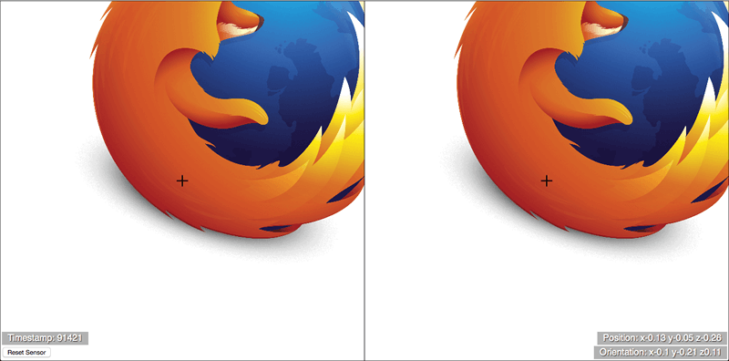

The [WebVR API](/zh-CN/docs/Web/API/WebVR_API) is a fantastic addition to the web developer's toolkit, allowing access to virtual reality hardware such as the [Oculus Rift](https://developer.oculus.com/), and converting outputted movement and orientation data into view rendering updates on a web app. But how do you get started in developing VR apps for the Web? This article will guide you through the basics.
[WebVR API](/zh-CN/docs/Web/API/WebVR_API) 对于 web 开发者来说，是一个令人心动的功能包，允许你连接到类似于[Oculus Rift](https://developer.oculus.com/) 这样的虚拟现实硬件，并且能够在你的 web app 中，将从硬件获取到的位置移动数据和姿态角数据，实时更新你的渲染显示输出。具体要如何在 Web 上开始开发你的 VR app 呢？这篇文章将会提供基础的引导信息。

> **备注：** Currently WebVR is at an experimental stage (you can find the [latest spec here](http://mozvr.github.io/webvr-spec/webvr.html)); it currently works best in Firefox Nightly/Developer Edition, with some aspects of it also working in Google Chrome. Read [Bringing VR to Chrome](http://blog.tojicode.com/2014/07/bringing-vr-to-chrome.html) by Brandon Jones for more details on that.
> 注意：当前 WebVR 还是体验实验阶段（你可以从[这里](http://mozvr.github.io/webvr-spec/webvr.html)找到最新规格说明）；它已经在 Firefox Nightly/Developer Edition 的版本上工作的很好了，部分功能也在 Google Chrome 上可以正常工作了。详细请访问由 Brandon Jones 在 [Bringing VR to Chrome](http://blog.tojicode.com/2014/07/bringing-vr-to-chrome.html)提供的更多内容。

## 起步

To get started, you need to have your VR hardware set up as recommended in the owner's manual, and your computer set up as indicated in [WebVR environment setup](/zh-CN/docs/Web/API/WebVR_API/WebVR_environment_setup). A dedicated GPU is recommended for smoother performance.
你需要先准备好一个已经配置好 VR 硬件，并且还需要完成 [WebVR 环境的安装](/zh-CN/docs/Web/API/WebVR_API/WebVR_environment_setup)。当然，若想要保证很平滑的体验，你需要配置一个足够好的 GPU 显卡。

You also need to have [Firefox Nightly](https://nightly.mozilla.org/) (or [Developer Edition](https://www.mozilla.org/en-US/firefox/developer/)) installed, along with the [WebVR Enabler Add-on](http://www.mozvr.com/downloads/webvr-addon-0.1.0.xpi)
安装好 [Firefox Nightly](https://nightly.mozilla.org/) (或 [Developer Edition](https://www.mozilla.org/en-US/firefox/developer/))，以及 [WebVR Enabler Add-on](http://www.mozvr.com/downloads/webvr-addon-0.1.0.xpi)

Once your environment is set up, try visiting one of our [MozVR projects](http://mozvr.com/projects/) and clicking on the "Enter VR" button to test it out.
设置好环境后，请尝试访问我们直接可在线运行的工程项目 [MozVR projects](http://mozvr.com/projects/) ，点击“Enter VR”按钮，就可以开始测试你的环境了。

> **备注：** For more in depth information, be sure to check out [WebVR environment setup](/zh-CN/docs/Web/API/WebVR_API/WebVR_environment_setup).
> 注意：更深层次的信息，请 check out [WebVR environment setup](/zh-CN/docs/Web/API/WebVR_API/WebVR_environment_setup) 以获取更详细的内容。

> **备注：** There are also cheaper options available such as using a mobile device for the head mounted display (in this case you won't have a position sensor available, so you might have to fake the orientation data using the [deviceorientation API](/zh-CN/Apps/Build/gather_and_modify_data/responding_to_device_orientation_changes) instead perhaps.)
> 注意：你也可以使用更便宜的方式，比如使用一个手机设备来实现头部显示功能（只是这种情况下，你将没有空间位置追踪传感器相关的功能，将只能使用姿态角数据相关的 API [deviceorientation API](/zh-CN/Apps/Build/gather_and_modify_data/responding_to_device_orientation_changes) 。）

## Introducing a simple demo<br>简单示例介绍

There are a number of WebVR demos available at the [MozVR team repo](https://github.com/MozVR/), and the [MDN webvr-tests repo](https://github.com/mdn/webvr-tests), but the main one we will be focusing on in this article is our [positionsensorvrdevice](https://github.com/mdn/webvr-tests/tree/gh-pages/positionsensorvrdevice) demo ([view it live](http://mdn.github.io/webvr-tests/positionsensorvrdevice/)):
在[MozVR team repo](https://github.com/MozVR/)和[MDN webvr-tests repo](https://github.com/mdn/webvr-tests)提供了一定数量的 WebVR 示例，在这篇文章里，我们将着重关注我们的 [positionsensorvrdevice](https://github.com/mdn/webvr-tests/tree/gh-pages/positionsensorvrdevice) 提供的示例 (点此访问 live [view it live](http://mdn.github.io/webvr-tests/positionsensorvrdevice/))



This is a simple 2.5D demo showing a Firefox logo seen on a left and right eye view, rendered on [HTML5 Canvas](/zh-CN/docs/Web/HTML/Element/canvas). When you view the demo with a VR HMD and click the canvas, the demo will go fullscreen, and you'll be able to approach the Firefox logo. It will move realistically as you move your head towards and away from it, up and down and side to side, and rotate your head in any direction.
这是一个简单的 2.5D 的示例，在左右眼两个区域，以[HTML5 Canvas](/zh-CN/docs/Web/HTML/Element/canvas)的方式，同时渲染了 Firefox 的 LOGO。当你使用 VR 头显来观看这个示例时，点击画面，这个 DEMO 就会切换到全屏形式，可以尝试靠近 Firefox 图标。将会非常真实地同步你的头部运动后应该看到的内容，包括可以上下移动、左右移动、转动你的头部看想看的方向。

The demo was deliberately kept simple so that you can easily see what is going on with the WebVR code. The API is simple enough that you can easily apply WebVR-controlled movement to any app you like, from simple DOM-based interfaces to complex WebGL scenes.
这个示例程序特意做成足够地简单，以便于你可以更容易地了解 WebVR 代码的工作过程。从代码中你可以看到，这些 API 足够的简单，你可以轻松地将这些 WebVR 控制移动和转动的能力，移植到新的应用功能中，比如一个简单的使用 WebGL 来显示的基于 DOM 接口的应用。

## How does the app work?<br>app 是怎样工作的呢？

In this section we'll go through the different parts of the code that make the app work, so you can see what's required at a basic level.
本章节，我们将通过不同形式的代码来运行，从而你可以了解到哪些东西是最基础的。

### Accessing the VR devices<br>连接并访问 VR 设备

The first thing to do is get a programmatic reference to the VR hardware connected to your computer. This is done using {{domxref("Navigator.getVRDevices")}}, which returns a promise that resolves to an array of all the vr devices connected to your computer.
首先，你需要获取连接到你当前电脑的 VR 硬件的程序对象的引用。通过调用{{domxref("Navigator.getVRDevices")}}这个 API，可以获取到已经连接到当前电脑的 VR 设备的数组。

There are two kinds of object that may be returned:
可能返回两种类型的对象：

- {{domxref("PositionSensorVRDevice")}}: A position sensor camera.
- {{domxref("PositionSensorVRDevice")}}：带空间位置定位的传感器摄像头。
- {{domxref("HMDVRDevice")}}: A VR head mounted display.
- {{domxref("HMDVRDevice")}}：VR 头显设备。

You can see some very simple code showing the kind of basic device information that can be returned in our [vrdevice demo](https://github.com/mdn/webvr-tests/tree/gh-pages/vrdevice).
在 [vrdevice demo](https://github.com/mdn/webvr-tests/tree/gh-pages/vrdevice) 中，使用简单代码即可以获取设备基础信息。

However, what you really want is something that grabs a pair of devices (perhaps many pairs in multiplayer VR games of the future). The following code taken from the WebVR spec (and also used in the [positionsensorvrdevice](https://github.com/mdn/webvr-tests/tree/gh-pages/positionsensorvrdevice) demo) does the trick pretty well:
当然，若你需要同时获取多套 VR 设备的信息（可能是将来多个玩家的多套设备），WebVR 说明书中包含的以下代码会更适合你来参考（在 [positionsensorvrdevice](https://github.com/mdn/webvr-tests/tree/gh-pages/positionsensorvrdevice) 示例代码中也有使用这段代码逻辑）。

```js
var gHMD, gPositionSensor;

navigator.getVRDevices().then(function (devices) {
  for (var i = 0; i < devices.length; ++i) {
    if (devices[i] instanceof HMDVRDevice) {
      gHMD = devices[i];
      break;
    }
  }

  if (gHMD) {
    for (var i = 0; i < devices.length; ++i) {
      if (
        devices[i] instanceof PositionSensorVRDevice &&
        devices[i].hardwareUnitId === gHMD.hardwareUnitId
      ) {
        gPositionSensor = devices[i];
        break;
      }
    }
  }
});
```

Here we grab the first instance we find of an {{domxref("HMDVRDevice")}} and store it in the `gHMD` variable. Next, we grab the first instance we find of a {{domxref("PositionSensorVRDevice")}} and store it in the `gPositionSensor` variable, but only if its {{domxref("VRDevice.hardWareUnitId")}} property matches that of the `gHMD` object. Separate devices that are part of the same overall hardware unit will share a hardware unit ID — this is how you check that you've got references to two matching devices.
这段代码，先获取第一个找到 {{domxref("HMDVRDevice")}} 类型的对象引用，赋值给 gHMD 变量。若获取到了，然后，再找到一个 {{domxref("PositionSensorVRDevice")}} 类型的对象引用，并且它与 gHMD 的 {{domxref("VRDevice.hardWareUnitId")}} 属性值相同时，即找到配对的对象，赋值给`gPositionSensor 变量。同一套设备单元中的多个分离的设备会共享他们的` hardware unit ID，可以依此来检测两个设备对象是否是同一套。

### Initialising the app 初始化 APP

The scene is rendered on a {{htmlelement("canvas")}} element, created and placed as follows:
场景最终是通过 {{htmlelement("canvas")}} 标记元素来显示。canvas 画布可通过以下 JS 代码来创建。

```js
var myCanvas = document.createElement("canvas");
var ctx = myCanvas.getContext("2d");
var body = document.querySelector("body");
body.appendChild(myCanvas);
```

Next, we create a new [image](/zh-CN/docs/Web/API/HTMLImageElement) and use a [`load`](/zh-CN/docs/Web/API/Window/load_event) event to check that the image is loaded before running `draw()`, the [main loop](/zh-CN/docs/Games/Anatomy#Building_a_main_loop_in_JavaScript) for our app:
然后，我们在主渲染循环控制中，先创建一个图片对象，并且在 draw() 方法运行前，监听 [`load`](/zh-CN/docs/Web/API/Window/load_event) 事件回调，以检查图片是否已经被正常装载成功。

```js
var image = new Image();
image.src = "firefox.png";
image.onload = draw;
```

### The main loop 渲染显示主循环

`draw()` looks like this:
draw() 方法的实现代码参考如下：

```js
function draw() {
  WIDTH = window.innerWidth;
  HEIGHT = window.innerHeight;
  lCtrOffset = WIDTH * 0.25;
  rCtrOffset = WIDTH * 0.25;

  myCanvas.width = WIDTH;
  myCanvas.height = HEIGHT;

  setView();
  drawImages();
  drawCrosshairs();

  requestAnimationFrame(draw);
}
```

The [window](/zh-CN/docs/Web/API/Window) `WIDTH` and `HEIGHT` is resampled on each frame then used to set:
在控制每一帧显示输出时，都有重新获取 [window](/zh-CN/docs/Web/API/Window) 窗口当前的宽、高，并依此来调整输出显示：

- A left and right offset value used to keep the image drawn relative to the center of the left and right eye view. Because we are drawing two half-width copies of the scene, the center of each copy is actually a quarter of the total canvas width in from the edge, in each case.
- The [width](/zh-CN/docs/Web/API/HTMLCanvasElement/width) and [height](/zh-CN/docs/Web/API/HTMLCanvasElement/height) of the canvas.

This is done so that the scene will resize correctly whenever the browser window is resized by the user.

Next in the loop we run three functions:

- `setView()` retrieves position and orientation information from the VR hardware, ready for use in drawing the updated image positions in the scene.
- `drawImages()` actually draws the updated image positions in the scene.
- `drawCrosshairs()` draws the crosshairs that remain in the center of the scene at all times.

You'll learn more about these later on.

Finally for the loop, we run [requestAnimationFrame(draw)](/zh-CN/docs/Web/API/window/requestAnimationFrame) so that the `draw()` loop is continually run.

### Retrieving position and orientation information 提取位置与姿态

Now lets study the `setView()` function in detail. We'll step through each part of the code, explaining what it all does:

```js
function setView() {
  var posState = gPositionSensor.getState();
```

First we call {{domxref("PositionSensorVRDevice.getState")}} on the reference to our position sensor. This method returns everything you might want to know about the current state of the HMD — accessible through a {{domxref("VRPositionState")}} object — including its position, orientation, and more advanced information such as linear and angular velocity/acceleration.

```js
if (posState.hasPosition) {
  posPara.textContent =
    "Position: x" +
    roundToTwo(posState.position.x) +
    " y" +
    roundToTwo(posState.position.y) +
    " z" +
    roundToTwo(posState.position.z);
  xPos = -posState.position.x * WIDTH * 2;
  yPos = posState.position.y * HEIGHT * 2;
  if (-posState.position.z > 0.01) {
    zPos = -posState.position.z;
  } else {
    zPos = 0.01;
  }
}
```

In the next part, we first check to make sure valid position information is available for the HMD using {{domxref("VRPositionState.hasPosition")}}, so that we don't return an error and stop the app working (if the HMD is switched off, or not pointing at the position sensor.)

Then we output the current position information to a paragraph in the app UI for information purposes (rounded to two decimal places using a custom function to make it more readable.)

Last up, we set our `xPos`, `yPos`, and `zPos` variables relative to the position information stored in {{domxref("VRPositionState.position")}}. You'll notice that we have used an `if ... else` block to make sure the `zPos` value stays at 0.01 or above — the app was throwing an error if it went below 0.

```js
if (posState.hasOrientation) {
  orientPara.textContent =
    "Orientation: x" +
    roundToTwo(posState.orientation.x) +
    " y" +
    roundToTwo(posState.orientation.y) +
    " z" +
    roundToTwo(posState.orientation.z);
  xOrient = posState.orientation.x * WIDTH;
  yOrient = -posState.orientation.y * HEIGHT * 2;
  zOrient = posState.orientation.z * 180;
}
```

Next, we use a similar process to update the scene according to the HMD's orientation — check that valid orientation data is available using {{domxref("VRPositionState.hasOrientation")}}, display orientation data in the UI for informational purposes, and then set the `xOrient`, `yOrient`, and `zOrient` values relative to the orientation information stored in {{domxref("VRPositionState.orientation")}}.

```
  timePara.textContent = 'Timestamp: ' + Math.floor(posState.timeStamp);
}
```

Finally, we output the current timeStamp stored in {{domxref("VRPositionState.timeStamp")}} to the UI for information. This value can be useful for determining if position data has been updated, and what order updates have occured in.

### Updating the scene 更新场景输出画画

The `xPos`, `yPos`, `zPos`, `xOrient`, `yOrient` and `zOrient` value retrieved by `setView()` are all used as modifiers for updating the scene rendering done by `drawImages()`. We'll look at how below, although we'll only walk through the code for drawing the left eye view (the other is very similar, but shifted over to the right):

```js
function drawImages() {
  ctx.fillStyle = 'white';
  ctx.fillRect(0,0,WIDTH,HEIGHT);
```

First we draw a white {{domxref("CanvasRenderingContext2D.fillRect","fillRect()")}} to clear the scene before the next frame is drawn.

```js
ctx.save();
ctx.beginPath();
ctx.translate(WIDTH / 4, HEIGHT / 2);
ctx.rect(-(WIDTH / 4), -(HEIGHT / 2), WIDTH / 2, HEIGHT);
```

Next, we save the context state with {{domxref("CanvasRenderingContext2D.save","save()")}} so we can treat the left eye view as a separate image and not have its code affect the right eye view.

We then {{domxref("CanvasRenderingContext2D.beginPath","begin a path")}}, {{domxref("CanvasRenderingContext2D.translate","translate the canvas")}} so that the origin is now in the center of the left eye view (a quarter of the width across and half the height down) — which is needed so that the rotation works correctly (rotation happens around the origin of the canvas) — and draw a {{domxref("CanvasRenderingContext2D.rect","rect()")}} around the whole left eye view.

Note that the `rect()` has to be drawn starting from minus a quarter of the width and minus half the height, because of the translation applied earlier.

```
  ctx.clip();
```

Now we {{domxref("CanvasRenderingContext2D.clip","clip()")}} the canvas. Because we called this just after the `rect()` was drawn, anything else that we do on the canvas will be constrained inside the `rect()`, with any overflow hidden until a `restore()` call is made (see later on.) This ensures that the whole left eye view will remain separate from the right eye view.

```js
ctx.rotate((zOrient * Math.PI) / 180);
```

A rotation is now applied to the image, related to the current value of `zOrient`, so that the scene rotates as you rotate your head.

```js
ctx.drawImage(
  image,
  -(WIDTH / 4) + lCtrOffset - image.width / (2 * (1 / zPos)) + xPos - yOrient,
  -(image.height / (2 * (1 / zPos))) + yPos + xOrient,
  image.width * zPos,
  image.height * zPos,
);
```

Now for the actual image drawing! This rather nasty line of code needs breaking down, so here it is, argument by argument:

- `image`: The image to be drawn
- `-(WIDTH/4)+lCtrOffset-((image.width)/(2*(1/zPos)))+xPos-yOrient`: The horizontal coordinate of the image origin. This first needs to be reduced by `WIDTH/4` to compensate for the translation done earlier. Then, we add the left center offset to put it back in the middle, then we subtract the image width divided by 2 times the reciprocal of `zPos` — so as the image is drawn smaller/larger the amount subtracted will get smaller/larger, again keeping the image in the center. Finally, we add the `xPos` and subtract the `yOrient` values to update the image position as the HMD is moved or rotated horizontally (rotation around the y axis moves the image horizontally.)
- `-((image.height)/(2*(1/zPos)))+yPos+xOrient`: The vertical coordinate of the image origin. In this case the "subtract HEIGHT/2" and "add right center offset" exactly cancel each other out, so I've just removed them from the equation. That just leaves subtracting the image width divided by 2 times the reciprocal of zPos to keep the image in the center, as above, and modifying the drawn position by `yPos` and `xOrient`.
- `image.width*zPos`: The width to draw the image; this is modified by `zPos` so it will be drawn bigger as you get closer to it.
- `image.height*zPos`: The height to draw the image; this is modified by `zPos` so it will be drawn bigger as you get closer to it.

```js
ctx.strokeStyle = "black";
ctx.stroke();
```

Next we draw a black {{domxref("CanvasRenderingContext2D.stroke","stroke()")}} around the left eye view, just to aid the view separation a bit more.

```js
ctx.restore();
```

Finally, we {{domxref("CanvasRenderingContext2D.restore","restore()")}} the canvas so we can then go on to draw the right eye view.

```js
  ...
}
```

> **备注：** We are kind of cheating here, using a 2D canvas to approximate a 3D scene. But it keeps things simple for learning purposes. You can use the position and orientation data discussed above to modify the view rendering on any app written with web technologies. For example, our [3Dpositionorientation](https://github.com/mdn/webvr-tests/tree/gh-pages/3Dpositionorientation) demo uses very similar code to that shown above to control the view of a WebGL scene created using [Three.js](http://threejs.org/).

> **备注：** The [code for `drawCrosshairs()`](https://github.com/mdn/webvr-tests/blob/gh-pages/positionsensorvrdevice/index.html#L106-L119) is very simple in comparison to `drawImages()`, so we'll leave you to study that for yourself if you're interested!

### Fullscreen 全屏控制

The VR effect is much more effective if you set your app runnning in [fullscreen mode](/zh-CN/docs/Web/Guide/API/DOM/Using_full_screen_mode) — this generally means setting your {{htmlelement("canvas")}} element to fullscreen when a specific event occurs — such as double-clicking the display or pressing a specific button.

In this case I have just kept things simple, running a `fullScreen()` function when the canvas is clicked:

```js
myCanvas.addEventListener("click", fullScreen, false);
```

The `fullScreen()` function checks which version of the `requestFullscreen()` method is present on the canvas (this will differ by browser) and then calls the appropriate one, for maximum compatibility:

```js
function fullScreen() {
  if (myCanvas.requestFullscreen) {
    myCanvas.requestFullscreen();
  } else if (myCanvas.msRequestFullscreen) {
    myCanvas.msRequestFullscreen();
  } else if (myCanvas.mozRequestFullScreen) {
    myCanvas.mozRequestFullScreen();
  } else if (myCanvas.webkitRequestFullscreen) {
    myCanvas.webkitRequestFullscreen();
  }
}
```

## Calibrating field of view and device orientation 对 FOV 与设备姿态进行归零显示

I've not given much thought to this in my current demo, but in commercial apps you'll need to do some user calibration to make sure your app is working for the user and their particular VR hardware. The WebVR API has a number of features to aid in this.

First of all, you can use the {{domxref("PositionSensorVRDevice.resetSensor")}} method to reset the HMD position orientation. Effectively what it does is to set the current position/orientation of the headset to 0. So you need to ensure it is held in a sensible 0 position before running the function. In our positionsensorvrdevice demo, you can play with it using our "Reset Sensor" button:

```html
<button>Reset Sensor</button>
```

```js
document.querySelector("button").onclick = function () {
  gPositionSensor.resetSensor();
};
```

The other thing to calibrate is the field of view (FOV) of your headset — how much of the scene can be seen in the up, right, down and left directions. This information can be retrieved for each eye separately using the {{domxref("HMDVRDevice.getEyeParameters")}} method, which returns parameters for each eye separately (you need to call it twice, once with a parameter of `left`, and once with a parameter of `right`.) This returns a {{domxref("VREyeParameters")}} object for each eye.

As an example, you could retrieve the current field of view for an eye using {{domxref("VREyeParameters.currentFieldOfView")}}. This returns a {{domxref("VRFieldOfView")}} object containing four properties:

- {{domxref("VRFieldOfViewReadOnly.upDegrees","upDegrees")}}: The number of degrees upwards that the field of view extends in.
- {{domxref("VRFieldOfViewReadOnly.rightDegrees","rightDegrees")}}: The number of degrees to the right that the field of view extends in.
- {{domxref("VRFieldOfViewReadOnly.downDegrees","downDegrees")}}: The number of degrees downwards that the field of view extends in.
- {{domxref("VRFieldOfViewReadOnly.leftDegrees","leftDegrees")}}: The number of degrees to the left that the field of view extends in.

The field of view created is a pyramid shape, the apex of which is emanating from the eye.

You could check whether the user has a suitable field of view for your app, and if not, set a new field of view using {{domxref("HMDVRDevice.setFieldOfView")}} method. A simple function to handle this might look like so:

```js
function setCustomFOV(up, right, down, left) {
  var testFOV = new VRFieldOfView(up, right, down, left);

  gHMD.setFieldOfView(testFOV, testFOV, 0.01, 10000.0);
}
```

This function accepts the four degree values as arguments, then creates a new {{domxref("VRFieldOfView")}} object using the VRFieldOfView() constructor. This is then fed into `setFieldOfView()` as the first two arguments (the FOV for the left eye and the right eye). The third and fourth arguments are the `zNear` and `zFar` values — how close and far away from the eye an object can be in the direction of the FOV and still be inside it.
