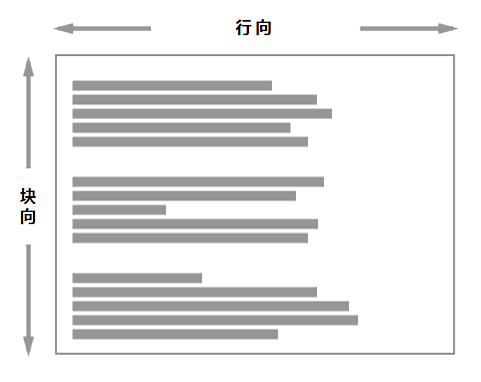
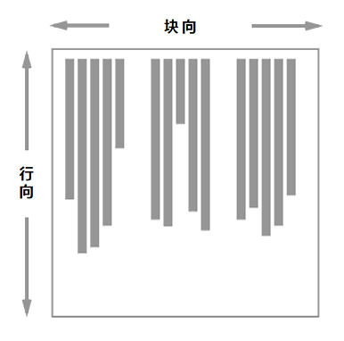

{{CSSRef}}

逻辑属性与逻辑值规范为 CSS 中的许多属性和值引入了相对于流的对应关系。本文介绍此规范，并解释相对于流的属性与值。

## 为什么我们需要逻辑属性？

传统的 CSS 根据屏幕的实体尺度设置物体尺寸。因此我们说盒子具有宽度（{{CSSXref("width")}}）和高度（{{CSSXref("height")}}），参照上侧（`top`）和左侧（`left`）为元素定位，将物体浮动至左侧，为上侧（`top`）、右侧（`right`）、下侧（`bottom`）、左侧（`left`）赋予边框和内外边距，等等。[逻辑属性与逻辑值规范](https://drafts.csswg.org/css-logical/)定义了从这些实体值到与之等价的逻辑值（即相对于流的值）的对应关系——如 `left` 和 `right`，或者 `top` 和 `bottom` 对应于 `start` 和 `end`。

举个例子说明为什么会需要这些对应关系。我有一个布局用了 CSS 网格，网格容器应用了宽度属性，而且我用 {{CSSXref("align-self")}} 和 {{CSSXref("justify-self")}} 属性对齐元素。这些属性是相对于流的——`justify-self: start` 将元素对齐到行首，`align-self: start` 在块向上的效果类似。

如果我现在用 {{CSSXref("writing-mode")}} 属性把这个组件的书写模式改成 `vertical-rl`，那么对齐方式还是一样的。现在行向是竖直方向而块向是水平方向。然而网格变了样，这是因为给容器赋的宽度是水平尺度，与它挂钩的是文本的实体延伸方向，而非逻辑或相对于流的延伸方向。

如果我们不用 `width` 属性而用逻辑属性 {{CSSXref("inline-size")}}，那现在无论用什么书写模式显示组件都没有问题。

你可以在下面的运行实例里尝试一下。把 `.grid` 的 `writing-mode` 从 `vertical-rl` 改成 `horizontal-tb`，看看不同的属性是怎么改变布局的。

{{EmbedGHLiveSample("css-examples/logical/intro-grid-example.html", "100%", 700)}}

在不是从横排上到下的书写模式里做网站，或者在用书写模式做创意的时候，能够对应到内容的流向上是非常合理的。

## 块向与行向尺度

在使用相对于流的属性和值时，一个关键的概念是块向与行向这两个方向。上文我们已经看到在对齐元素时，诸如弹性盒和网格布局等新的 CSS 布局方法所用的概念是块向（`block`）和行向（`inline`），而非右侧（`right`）和左侧（`left`），或者上侧（`top`）和下侧（`bottom`）。

行向是指在所用的书写模式中，一行文本延伸的方向。因此在从左到右横排的英文文档，或者从右到左横排的阿拉伯文文档中，行向为*水平方向*。若切换至竖排书写模式（如日文文档）则行向变为*竖直方向*，这是因为文本在这种书写模式中竖直延伸。

块向是指另一方向，即块——例如段落——依次显示的方向。在英文和阿拉伯文中，块沿竖直方向依次排列，而块在任意竖排书写模式中沿水平方向依次排列。

下图展示了横排书写模式中的行向与块向：

此图展示了竖排书写模式中的块向与行向：

## 参见

- [网格布局中的盒对齐](/zh-CN/docs/Web/CSS/CSS_grid_layout/Box_alignment_in_grid_layout)
- [弹性布局中的盒对齐](/zh-CN/docs/Web/CSS/CSS_box_alignment/Box_alignment_in_flexbox)
- [Understanding Logical Properties and Values](https://www.smashingmagazine.com/2018/03/understanding-logical-properties-values/)
- [书写模式](/zh-CN/docs/Web/CSS/CSS_flow_layout/Flow_layout_and_writing_modes)
