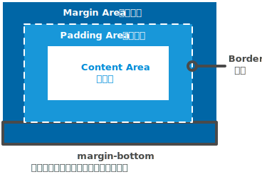

{{CSSRef}}

## Summary



CSS 的 `margin-bottom` 属性用于设置元素的底部外边距，允许设置负数值。一个正数值将让它相对于正常流与邻近块更远，而负数值将使得更近。

该属性对于*不可替代 (non-replaced 元素在规范中有概念，请自行搜索)*的行级元素没有效果，比如： {{HTMLElement("tt")}} 或者 {{HTMLElement("span")}}.

{{cssinfo}}

## 语法

```css
/* <length> values */
margin-bottom: 10px; /* 一个绝对的长度值 */
margin-bottom: 1em; /* A length relative to the text size */
margin-bottom: 5%; /* A margin relative to the nearest block container's width */

/* Keyword values */
margin-bottom: auto;

/* Global values */
margin-bottom: inherit;
margin-bottom: initial;
margin-bottom: unset;
```

### 值

- `<length>`
  - : 定义了一个确定的宽度值，参见 {{cssxref("&lt;length&gt;")}} 以了解更多可能的值。
- `<percentage>`
  - : {{cssxref("&lt;percentage&gt;")}} 始终与包含该元素的**容器宽度**有关。
- `auto`
  - : 由浏览器自己选择一个合适的值。参见 {{cssxref("margin")}}。

### 形式语法

{{csssyntax}}

## 示例

### HTML

```html
<div class="container">
  <div class="box0">Box 0</div>
  <div class="box1">Box 1</div>
  <div class="box2">Box one's negative margin pulls me up</div>
</div>
```

### CSS

用于设置 `div` 的 `margin-bottom` 和 `height` 的 CSS 代码

```css
.box0 {
  margin-bottom: 1em;
  height: 3em;
}
.box1 {
  margin-bottom: -1.5em;
  height: 4em;
}
.box2 {
  border: 1px dashed black;
  border-width: 1px 0;
  margin-bottom: 2em;
}
```

为了使 `margin` 产生的影响更明显，添加了一些 `container` 和 `div` 的样式定义

```css
.container {
  background-color: orange;
  width: 320px;
  border: 1px solid black;
}
div {
  width: 320px;
  background-color: gold;
}
```

{{ EmbedLiveSample('示例',350,200) }}

## 规范

{{Specifications}}

## 浏览器兼容性

{{Compat}}
