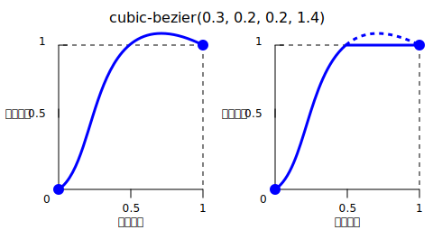

[CSS](/zh-CN/docs/Web/CSS) [数据类型](/zh-CN/docs/Web/CSS/Reference/Values/Data_types) **`<easing-function>`** 表示描述某数值变化速率的数学函数。

这种两值之间的过渡可应用于不同情境，可用于描述属性值在动画中变化的快慢程度，由此得以在动画的持续过程中改变其速度。你可为 CSS [过渡](/zh-CN/docs/Web/CSS/Reference/Properties/transition-timing-function)和[动画](/zh-CN/docs/Web/CSS/Reference/Properties/animation-timing-function)指定缓动函数。

## 语法

```css
/* 线性函数和关键字 */
/* linear(<point-list>) */
linear(1, -0.5, 0)
linear

/* 三次贝塞尔函数和关键字 */
/* cubic-bezier(<x1>, <y1>, <x2>, <y2>) */
cubic-bezier(0.42, 0.0, 1.0, 1.0)
ease
ease-in
ease-out
ease-in-out

/* 阶跃函数和关键字 */
/* steps(<number-of-steps>, <direction>) */
steps(4, end)
step-start
step-end
```

### 取值

- `<point-list>`
  - : 线性定格列表。

- `linear`
  - : 表示线性插值。此关键字表示缓动函数 `linear(0, 1)`。


- `<x1>`, `<y1>`, `<x2>`, `<y2>`
  - : 表示定义三次贝塞尔曲线的 [P1 和 P2 点](#三次贝塞尔函数)的横纵坐标的 {{CSSXref("&lt;number&gt;")}} 值。`x1` 和 `x2` 须位于 `[0, 1]` 范围中，否则此值无效。

- `ease`
  - : 表示插值缓慢开始，陡然加速，再逐渐减速至结束。此关键字表示缓动函数 `cubic-bezier(0.25, 0.1, 0.25, 1.0)`。其与 [`ease-in-out`](#ease-in-out) 相似，但在开始时加速更陡。

- `ease-in`
  - : 表示插值缓慢开始，再逐渐加速至结束，最终突然停止。此关键字表示缓动函数 `cubic-bezier(0.42, 0.0, 1.0, 1.0)`。

- `ease-out`
  - : 表示插值突然开始，再逐渐减速至结束。此关键字表示缓动函数 `cubic-bezier(0.0, 0.0, 0.58, 1.0)`。

- `ease-in-out`
  - : 表示插值缓慢开始，然后加速，再减速至结束。此关键字表示缓动函数 `cubic-bezier(0.42, 0.0, 0.58, 1.0)`。在开始时，此关键字表现同 [`ease-in`](#ease-in) 关键字；在结束时，表现同 [`ease-out`](#ease-out) 关键字。


- `<number-of-steps>`
  - : 严格正的 {{CSSXref("&lt;integer&gt;")}}，表示构成阶跃函数的等距步数。

- `<direction>`
  - : 下列表示跳跃何时出现的关键字之一：
    - `jump-start` 表示第一步（即第一次跳跃）在插值开始时发生。
    - `jump-end` 表示最后一步（即最后一次跳跃）在插值结束时发生。
    - `jump-both` 表示在 0% 和 100% 处均出现跳跃，相当于在插值过程中加上一步。
    - `jump-none` 表示两端均无跳跃，而是在 0% 处和 100% 处将值各保持 1/n 的时长。
    - `start` 与 `jump-start` 等价。
    - `end` 与 `jump-end` 等价。此关键字为默认值。

- `step-start`
  - : 表示插值立即跳跃至其最终状态，再保持至结束。此关键字表示缓动函数 `steps(1, jump-start)` 或 `steps(1, start)`。

- `step-end`
  - : 表示插值保持其初始状态至结束，再直接跳跃至其最终状态。此关键字表示缓动函数 `steps(1, jump-end)` 或 `steps(1, end)`。


## 描述

缓动函数有三种类型：

- [线性](#线性缓动函数)
- [三次贝塞尔](#三次贝塞尔缓动函数)
- [阶跃](#阶跃缓动函数)

### 线性缓动函数

`linear()` 函数定义了在各点之间线性插值的分段线性函数，由此可以近似如反弹和弹性效应等更复杂的动画。插值自始至终以恒定速率进行。`linear()` 函数的一个典型用处在于提供很多点逼近任意曲线。

在定义 `linear()` 函数时，可由列表指定*线性缓动点*，例如 `linear(0, 0.25, 1)`。此 `linear()` 函数所产生的缓动函数从 `0` 线性移动至 `0.25`，再移动至 `1`。


考虑此函数另一例子——`linear(0, 0.25 75%, 1)`。此例所产生的线性缓动函数用 75% 的时间从 `0` 过渡到 `0.25`，余下 25% 的时间从 `0.25` 过渡到 `1`。

[`linear`](#linear) 关键字等价于缓动函数 `linear(0, 1)`。

### 三次贝塞尔缓动函数

函数记号 `cubic-bezier()` 定义了三次[贝塞尔曲线](/zh-CN/docs/Glossary/Bezier_curve)。属于三次贝塞尔类的缓动函数常被称为“平滑”缓动函数，这是因为这些函数可用于抚平{{Glossary("interpolation", "插值")}}的起止。这些函数将输入进度与输出进度相关联，两个进度均以 {{CSSXref("&lt;number&gt;")}} 表示。对于这些值，`0.0` 表示初始状态，`1.0` 表示最终状态。


三次贝塞尔曲线由 P0、P1、P2 和 P3 四点所定义。点 P0 和 P3 表示曲线的起止点。在 CSS 中，由于坐标为进度（横坐标为输入进度，纵坐标为输出进度），故这两点为定点。P0 为 `(0, 0)`，表示初始进度和初始状态。P3 为 `(1, 1)`，表示最终进度和最终状态。

并非所有三次贝塞尔曲线均适合作为缓动函数，这是因为某些曲线并非[数学函数](https://zh.wikipedia.org/wiki/函数)，即对于指定的横坐标有零个或一个值的曲线。由于 CSS 定义 P0 和 P3 为定点，故当且仅当 P1 和 P2 的横坐标均位于 `[0, 1]` 范围中时，三次贝塞尔曲线为函数，进而有效。

P1 和 P2 的纵坐标位于 `[0, 1]` 范围外的三次贝塞尔曲线可导致值超过最终状态后再折返。在动画中，对于例如 {{CSSXref("left")}} 和 {{CSSXref("right")}} 等某些属性由此创造某种“反弹”效应。



然而某些属性将限制超出允许范围的输出。例如在 {{CSSXref("color_value/rgb", "rgb()")}} 中大于 `255` 或小于 `0` 的颜色分量将被截断至最近的允许值（分别为 `255` 和 `0`）。某些 `cubic-bezier()` 函数展现了此性质。

当指定无效的三次贝塞尔曲线时，CSS 将无视整个属性。

关键字 [`ease`](#ease)、[`ease-in`](#ease-in)、[`ease-out`](#ease-out) 和 [`ease-in-out`](#ease-in-out) 中的每一个均等价于特定的 `cubic-bezier()` 值。

### 阶跃缓动函数

函数记号 `steps()` 定义了将输出值域分为等距步长的[阶跃函数](https://zh.wikipedia.org/wiki/阶跃函数)。此类阶跃函数有时也称为*阶梯函数*。

展示 `steps()` 函数用法的若干示例：

```css
steps(2, jump-start) /* 同 steps(2, start) */
steps(4, jump-end) /* 同 steps(4, end) */
steps(5, jump-none)
steps(3, jump-both)
```

![“输出进度”关于“输入进度”的图像，其中“steps(2, jump-start)”展示了分别从 (0, 0.5) 和 (0.5, 1) 延伸 0.5 个单位的水平直线及位于原点和 (0.5, 0.5) 的空心点；“steps(4, jump-end)”展示了分别从 (0, 0)、(0.25, 0.25)、(0.5, 0.5) 和 (0.75, 0.75) 延伸 0.25 个单位的水平直线、位于 (0.25, 0)、(0.5, 0.25) 和 (0.75, 0.5) 的空心点及位于 (1, 1) 的点；“steps(5, jump-none)”展示了分别从 (0, 0)、(0.2, 0.25)、(0.4, 0.5)、(0.6, 0.75) 和 (0.8, 1) 延伸 0.2 个单位的水平直线及位于 (0.2, 0)、(0.4, 0.25)、(0.6, 0.5) 和 (0.8, 0.75) 的空心点；“steps(3, jump-both)”展示了分别从 (0, 0.25)、(1/3, 0.5) 和 (2/3, 0.75) 延伸 1/3 个单位的水平直线、位于 (1, 1) 的点及位于原点、(1/3, 0.25)、(2/3, 0.5) 和 (1, 0.75) 的空心点](jump.svg)

关键字 [`step-start`](#step-start) 和 [`step-end`](#step-end) 中的任意一个均等价于特定的 `steps()` 值。

## 形式语法

{{CSSSyntax}}

## 示例

### 比较各种缓动函数

此示例用动画提供了不同的缓动函数之间的简单比较。在下拉菜单中可选择缓动函数——有若干关键字和一些 `cubic-bezier()` 和 `steps()` 选项。在选择选项后，可用所提供的按钮开始和停止动画。

#### HTML

```html
<div>
  <div></div>
</div>
<ul>
  <li>
    <button class="animation-button">开始动画</button>
  </li>
  <li>
    <label for="easing-select">选择缓动函数：</label>
    <select id="easing-select">
      <option selected>linear</option>
      <option>linear(0, 0.5 50%, 1)</option>
      <option>ease</option>
      <option>ease-in</option>
      <option>ease-in-out</option>
      <option>ease-out</option>
      <option>cubic-bezier(0.1, -0.6, 0.2, 0)</option>
      <option>cubic-bezier(0, 1.1, 0.8, 4)</option>
      <option>steps(5, end)</option>
      <option>steps(3, start)</option>
      <option>steps(4)</option>
    </select>
  </li>
</ul>
```

#### CSS

```css
body > div {
  position: relative;
  height: 100px;
}

div > div {
  position: absolute;
  width: 50px;
  height: 50px;
  background-color: blue;
  background-image: radial-gradient(
    circle at 10px 10px,
    rgba(25, 255, 255, 0.8),
    rgba(25, 255, 255, 0.4)
  );
  border-radius: 50%;
  top: 25px;
  animation: 1.5s infinite alternate;
}

@keyframes move-right {
  from {
    left: 10%;
  }

  to {
    left: 90%;
  }
}

li {
  display: flex;
  align-items: center;
  justify-content: center;
  margin-bottom: 20px;
}
```

#### JavaScript

```js
const selectElem = document.querySelector("select");
const startBtn = document.querySelector("button");
const divElem = document.querySelector("div > div");

startBtn.addEventListener("click", () => {
  if (startBtn.textContent === "开始动画") {
    divElem.style.animationName = "move-right";
    startBtn.textContent = "停止动画";
    divElem.style.animationTimingFunction = selectElem.value;
  } else {
    divElem.style.animationName = "unset";
    startBtn.textContent = "开始动画";
  }
});

selectElem.addEventListener("change", () => {
  divElem.style.animationTimingFunction = selectElem.value;
});
```

#### 结果

{{EmbedLiveSample("比较各种缓动函数", "100%", 200)}}

### 使用 cubic-bezier() 函数

这些三次贝塞尔曲线在用于 CSS 时有效：

```css example-good
/* 含四个位于 [0, 1] 范围中的 <number> 的标准贝塞尔曲线 */
cubic-bezier(0.1, 0.7, 1.0, 0.1)

/* 因为任意 <integer> 也均为 <number>，所以使用 <integer> 有效。*/
cubic-bezier(0, 0, 1, 1)

/* 负值为有效的纵坐标，将导致反弹效果。*/
cubic-bezier(0.1, -0.6, 0.2, 0)

/* 大于 1.0 的值也为有效的纵坐标。*/
cubic-bezier(0, 1.1, 0.8, 4)
```

这些三次贝塞尔曲线的定义无效：

```css example-bad
/* 尽管动画的输出类型可能为颜色，但是贝塞尔曲线使用数值比值。*/
cubic-bezier(0.1, red, 1.0, green)

/* 横坐标须位于 [0, 1] 范围中，否则曲线不是关于时间的函数。*/
cubic-bezier(2.45, 0.6, 4, 0.1)

/* 两个点均须定义，无默认值。*/
cubic-bezier(0.3, 2.1)

/* 横坐标须位于 [0, 1] 范围中，否则曲线不是关于时间的函数。*/
cubic-bezier(-1.9, 0.3, -0.2, 2.1)
```

### 使用 steps() 函数

这些缓动函数有效：

```css example-good
/* 有 5 次踏步，最后一步恰好发生在动画结束前。*/
steps(5, end)

/* 两步阶梯，第一步发生在动画开始时。*/
steps(2, start)

/* 第二个参数为可选的。*/
steps(2)
```

> [!NOTE]
> 若动画含有多个定格，则在 `steps()` 中所指定的步子将应用于每一段。因此含三个区段和 `steps(2)` 的动画将总共含有 6 步，每段 2 步。

这些缓动函数无效：

```css example-bad
/* 第一个参数须为 <integer>，不能为实数值，即使此值等于某 <integer> 也不行。*/
steps(2.0, jump-end)

/* 步数须非负。*/
steps(-3, start)

/* 须至少有一步。*/
steps(0, jump-none)
```

## 规范

{{Specifications}}

## 浏览器兼容性

{{Compat}}

## 参见

- [CSS 动画](/zh-CN/docs/Web/CSS/Guides/Animations)
- [CSS 过渡](/zh-CN/docs/Web/CSS/Guides/Transitions)
- [cubic-bezier](https://cubic-bezier.com/)
