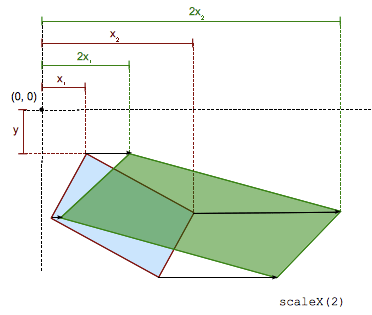

{{CSSRef}}

**`scaleX()`** CSS 函数将每个元素点的横坐标修改为一个常数因子，除了该比例因子为 1，在这种情况下，函数是身份变换。缩放不是各向同性的，并且元素的角度不保守。



`scaleX(sx)` 是 `scale(sx, 1)` 或 `scale3d(sx, 1, 1)` 的一个速记/缩写。

> **备注：** Note:
>
> **`scaleX(-1)`** 定义一个 [轴向对称性 (axial symmetry)](http://en.wikipedia.org/wiki/Axial_symmetry) ，它具有一个垂直轴通过原点 (由 {{cssxref("transform-origin")}} 属性规定)。

## Syntax

```
scaleX(s)
```

## Values

- _s_
  - : Is a {{cssxref("&lt;number&gt;")}} representing the scaling factor to apply on the abscissa of each point of the element.

<table class="standard-table">
  <thead>
    <tr>
      <th scope="col">Cartesian coordinates on ℝ<sup>2</sup></th>
      <th scope="col">Homogeneous coordinates on ℝℙ<sup>2</sup></th>
      <th scope="col">Cartesian coordinates on ℝ<sup>3</sup></th>
      <th scope="col">Homogeneous coordinates on ℝℙ<sup>3</sup></th>
    </tr>
  </thead>
  <tbody>
    <tr>
      <td colspan="1" rowspan="2">
        <math
          ><mfenced
            ><mtable
              ><mtr><mtd>s</mtd><mtd>0</mtd></mtr>
              <mtr><mtd>0</mtd><mtd>1</mtd></mtr></mtable
            ></mfenced
          ></math
        >
      </td>
      <td>
        <math
          ><mfenced
            ><mtable
              ><mtr>s<mtd>0</mtd><mtd>0</mtd></mtr
              ><mtr>0<mtd>1</mtd><mtd>0</mtd></mtr
              ><mtr><mtd>0</mtd><mtd>0</mtd><mtd>1</mtd></mtr></mtable
            ></mfenced
          ></math
        >
      </td>
      <td colspan="1" rowspan="2">
        <math
          ><mfenced
            ><mtable
              ><mtr>s<mtd>0</mtd><mtd>0</mtd></mtr
              ><mtr>0<mtd>1</mtd><mtd>0</mtd></mtr
              ><mtr><mtd>0</mtd><mtd>0</mtd><mtd>1</mtd></mtr></mtable
            ></mfenced
          ></math
        >
      </td>
      <td colspan="1" rowspan="2">
        <math
          ><mfenced
            ><mtable
              ><mtr>s<mtd>0</mtd><mtd>0</mtd><mtd>0</mtd></mtr
              ><mtr>0<mtd>1</mtd><mtd>0</mtd><mtd>0</mtd></mtr
              ><mtr><mtd>0</mtd><mtd>0</mtd><mtd>1</mtd><mtd>0</mtd></mtr
              ><mtr
                ><mtd>0</mtd><mtd>0</mtd><mtd>0</mtd><mtd>1</mtd></mtr
              ></mtable
            ></mfenced
          ></math
        >
      </td>
    </tr>
    <tr>
      <td><code>[s 0 0 1 0 0]</code></td>
    </tr>
  </tbody>
</table>

## Examples

### Without changing the origin

#### HTML

```html
<p>foo</p>
<p class="transformed">bar</p>
```

#### CSS

```css
p {
  width: 50px;
  height: 50px;
  background-color: teal;
}

.transformed {
  transform: scaleX(2);
  background-color: blue;
}
```

#### Result

{{EmbedLiveSample("Without_changing_the_origin","100%","200")}}

### Translating the origin of the transformation

#### HTML

```html
<p>foo</p>
<p class="transformed">bar</p>
```

#### CSS

```css
p {
  width: 50px;
  height: 50px;
  background-color: teal;
}

.transformed {
  transform: scaleX(2);
  transform-origin: left;
  background-color: blue;
}
```

#### Result

{{EmbedLiveSample("Translating_the_origin_of_the_transformation","100%","200")}}

## 规范

{{Specifications}}
