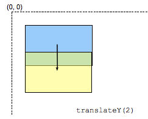

{{CSSRef}}

`translateY()` 在页面垂直移动元素，结果是 CSS 数据类型 {{cssxref("&lt;transform-function&gt;")}}。



> **备注：** `translateY(ty)` 对应 `translate(0, ty)` 或`translate3d(0, ty, 0)`。

## 语法

```css
/* <length-percentage> values */
transform: translateY(200px);
transform: translateY(50%);
```

## 值

- {{cssxref("&lt;length&gt;")}} 或 {{cssxref("&lt;percentage&gt;")}}
  - : 表示变换向量的纵坐标。百分比指的是盒子高度，盒子由属性 {{cssxref("transform-box")}} 定义。

<table class="standard-table">
  <thead>
    <tr>
      <th scope="col">笛卡尔坐标 ℝ<sup>2</sup></th>
      <th scope="col"><p>在ℝℙ<sup>2</sup>上的同类坐标</p></th>
      <th scope="col"><p>在ℝ<sup>3</sup>上的笛卡尔坐标</p></th>
      <th scope="col"><p>在ℝℙ<sup>3</sup>同类坐标</p></th>
    </tr>
  </thead>
  <tbody>
    <tr>
      <td colspan="1" rowspan="2">
        <p>
          在ℝ<sup>2 </sup
          >上的转换不会是线性变换但是并不能代表在笛卡尔坐标系统中使用矩阵
        </p>
      </td>
      <td>
        <math
          ><mfenced
            ><mtable
              ><mtr>1<mtd>0</mtd><mtd>0</mtd></mtr
              ><mtr>0<mtd>1</mtd><mtd>t</mtd></mtr
              ><mtr><mtd>0</mtd><mtd>0</mtd><mtd>1</mtd></mtr></mtable
            ></mfenced
          ></math
        >
      </td>
      <td colspan="1" rowspan="2">
        <math
          ><math
            ><mfenced
              ><mtable
                ><mtr>1<mtd>0</mtd><mtd>0</mtd></mtr
                ><mtr>0<mtd>1</mtd><mtd>t</mtd></mtr
                ><mtr><mtd>0</mtd><mtd>0</mtd><mtd>1</mtd></mtr></mtable
              ></mfenced
            ></math
          ></math
        >
      </td>
      <td colspan="1" rowspan="2">
        <math
          ><mfenced
            ><mtable
              ><mtr>1<mtd>0</mtd><mtd>0</mtd><mtd>0</mtd></mtr
              ><mtr>0<mtd>1</mtd><mtd>0</mtd><mtd>t</mtd></mtr
              ><mtr><mtd>0</mtd><mtd>0</mtd><mtd>1</mtd><mtd>0</mtd></mtr
              ><mtr
                ><mtd>0</mtd><mtd>0</mtd><mtd>0</mtd><mtd>1</mtd></mtr
              ></mtable
            ></mfenced
          ></math
        >
      </td>
    </tr>
    <tr>
      <td><code>[1 0 0 1 0 t]</code></td>
    </tr>
  </tbody>
</table>

### 语法

```
translateY({{cssxref("&lt;length-percentage&gt;")}})
```

## 示例

### HTML

```html
<div>Static</div>
<div class="moved">Moved</div>
<div>Static</div>
```

### CSS

```css
div {
  width: 60px;
  height: 60px;
  background-color: skyblue;
}

.moved {
  transform: translateY(10px);
  background-color: pink;
}
```

### 结果

{{EmbedLiveSample("示例", 250, 250)}}

## 规范

{{Specifications}}

## 浏览器兼容性

{{Compat}}

## 参见

- {{cssxref("transform")}}
- {{cssxref("&lt;transform-function&gt;")}}
