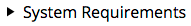
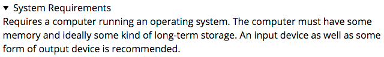

{{HTMLSidebar}}

**HTML `<details>`元素**可创建一个挂件，仅在被切换成展开状态时，它才会显示内含的信息。{{HTMLElement("summary")}} 元素可为该部件提供概要或者标签。

A disclosure widget is typically presented onscreen using a small triangle which rotates (or twists) to indicate open/closed status, with a label next to the triangle. If the first child of the `<details>` element is a `<summary>`, the contents of the `<summary>` element are used as the label for the disclosure widget.

{{EmbedInteractiveExample("pages/tabbed/details.html", "tabbed-standard")}}

> **备注：** The common use of a triangle which rotates or twists around to represent opening or closing the widget is why these are sometimes called "twisties."

同一个 `<details>` 组件只能处于两种状态之一。The default _closed_ state displays only the triangle and the label inside `<summary>` (or a {{Glossary("user agent")}}-defined default string if no `<summary>`). This might look like the following:



Here we see a standard disclosure widget with the label "System Requirements", in its default closed state. When the user clicks on the widget, or focuses it then presses the space bar, it "twists" open, revealing its contents:



From there, you can use CSS to style the disclosure widget, and you can programmatically open and close the widget by setting/removing its {{htmlattrxref("open", "details")}} attribute.

By default when closed, the widget is only tall enough to display the disclosure triangle and summary. When open, it expands to display the details contained within.

> **备注：** Unfortunately, at this time there's no built-in way to animate the transition between open and closed.

Fully standards-compliant implementations automatically apply the CSS `{{cssxref("display")}}: list-item` to the {{HTMLElement("summary")}} element. You can use this to customize its appearance further. See [Customizing the disclosure widget](#自定义自带部件的样式) for further details.

<table class="properties">
 <tbody>
  <tr>
   <th scope="row"><a href="/zh-CN/docs/Web/HTML/Content_categories">Content categories</a></th>
   <td><a href="/zh-CN/docs/Web/HTML/Content_categories#Flow_content">Flow content</a>, sectioning root, interactive content, palpable content.</td>
  </tr>
  <tr>
   <th scope="row">Permitted content</th>
   <td>One {{HTMLElement("summary")}} element followed by <a href="/zh-CN/docs/Web/HTML/Content_categories#Flow_content">flow content</a>.</td>
  </tr>
  <tr>
   <th scope="row">Tag omission</th>
   <td>{{no_tag_omission}}</td>
  </tr>
  <tr>
   <th scope="row">Permitted parents</th>
   <td>Any element that accepts <a href="/zh-CN/docs/Web/HTML/Content_categories#Flow_content">flow content</a>.</td>
  </tr>
  <tr>
   <th scope="row">Permitted ARIA roles</th>
   <td>None</td>
  </tr>
  <tr>
   <th scope="row">DOM interface</th>
   <td>{{domxref("HTMLDetailsElement")}}</td>
  </tr>
 </tbody>
</table>

## 属性

此元素仅包含[全局属性](/zh-CN/docs/Web/HTML/Global_attributes)。

- {{htmlattrdef("open")}}
  - : This Boolean attribute indicates whether or not the details — that is, the contents of the `<details>` element — are currently visible. The default, `false`, means the details are not visible.

## 事件

In addition to the usual events supported by HTML elements, the `<details>` element supports the {{domxref("HTMLDetailsElement/toggle_event", "toggle")}} event, which is dispatched to the `<details>` element whenever its state changes between open and closed. It is sent _after_ the state is changed, although if the state changes multiple times before the browser can dispatch the event, the events are coalesced so that only one is sent.

You can listen for the `toggle` event to detect when the widget changes state:

```js
details.addEventListener("toggle", event => {
  if (details.open) {
    /* the element was toggled open */
  } else {
    /* the element was toggled closed */
  }
});
```

## 示例

### A simple disclosure example

This example shows a `<details>` element with no provided summary.

```html
<details>
  <p>Requires a computer running an operating system. The computer
  must have some memory and ideally some kind of long-term storage.
  An input device as well as some form of output device is
  recommended.</p>
</details>
```

In this situation, the browser will use a default summary string (usually "Details"). Here's what your browser does with it:

{{EmbedLiveSample("A_simple_disclosure_example", 650, 150)}}

### Providing a summary

This example adds a summary to the above example by using the {{HTMLElement("summary")}} element inside `<details>`, like this:

```html
<details>
  <summary>System Requirements</summary>
  <p>Requires a computer running an operating system. The computer
  must have some memory and ideally some kind of long-term storage.
  An input device as well as some form of output device is
  recommended.</p>
</details>
```

The result from this HTML is this:

{{EmbedLiveSample("Providing_a_summary", 650, 150)}}

### Creating an open disclosure box

To start the `<details>` box in its open state, add the Boolean `open` attribute:

```html
<details open>
  <summary>System Requirements</summary>
  <p>Requires a computer running an operating system. The computer
  must have some memory and ideally some kind of long-term storage.
  An input device as well as some form of output device is
  recommended.</p>
</details>
```

This results in:

{{EmbedLiveSample("Creating_an_open_disclosure_box", 650, 150)}}

### Customizing the appearance

Now let's apply some CSS to customize the appearance of the disclosure box.

#### CSS

```css
details {
  font: 16px "Open Sans", "Arial", sans-serif;
  width: 620px;
}

details > summary {
  padding: 2px 6px;
  width: 15em;
  background-color: #ddd;
  border: none;
  box-shadow: 3px 3px 4px black;
}

details > p {
  border-radius: 0 0 10px 10px;
  background-color: #ddd;
  padding: 2px 6px;
  margin: 0;
  box-shadow: 3px 3px 4px black;
}
```

This CSS creates a look similar to a tabbed interface, where clicking the tab opens it to reveal its contents.

#### HTML

```html
<details>
  <summary>System Requirements</summary>
  <p>Requires a computer running an operating system. The computer
  must have some memory and ideally some kind of long-term storage.
  An input device as well as some form of output device is
  recommended.</p>
</details>
```

#### 结果

{{EmbedLiveSample("Customizing_the_appearance", 650, 150)}}

### 自定义自带部件的样式

自带的三角形可以自定义，但并没有得到广泛支持。由于该元素是标准化的，因此在实验性实施阶段，浏览器如何支持此自定义项有所不同，我们不得不暂时使用多种方法。

{{HTMLElement("summary")}} 元素支持 {{cssxref("list-style")}}缩写属性或者完全属性，比如{{cssxref("list-style-type")}}，可以使用它们任意改变三角（通常是使用{{cssxref("list-style-image")}}）。例如，我们可以使用`list-style: none`移除三角形。

Chrome 尚不支持此功能，因此我们还需要使用其非标准`::-webkit-details-marker`[伪元素](/zh-CN/docs/Web/CSS/Pseudo-elements)来自定义。

#### CSS

```css
details {
  font: 16px "Open Sans", "Arial", sans-serif;
  width: 620px;
}

details > summary {
  padding: 2px 6px;
  width: 15em;
  background-color: #ddd;
  border: none;
  box-shadow: 3px 3px 4px black;
  list-style: none;
}

details > summary::-webkit-details-marker {
  display: none;
}

details > p {
  border-radius: 0 0 10px 10px;
  background-color: #ddd;
  padding: 2px 6px;
  margin: 0;
  box-shadow: 3px 3px 4px black;
}
```

该 CSS 的外观类似于选项卡界面，在该界面中，激活选项卡将展开并打开它以显示其内容。

#### HTML

```html
<details>
  <summary>System Requirements</summary>
  <p>Requires a computer running an operating system. The computer
  must have some memory and ideally some kind of long-term storage.
  An input device as well as some form of output device is
  recommended.</p>
</details>
```

#### 结果

{{EmbedLiveSample("Customizing_the_disclosure_widget", 650, 150)}}

## 规范

{{Specifications}}

## 浏览器兼容性

{{Compat}}

## 参见

- {{HTMLElement("summary")}}
