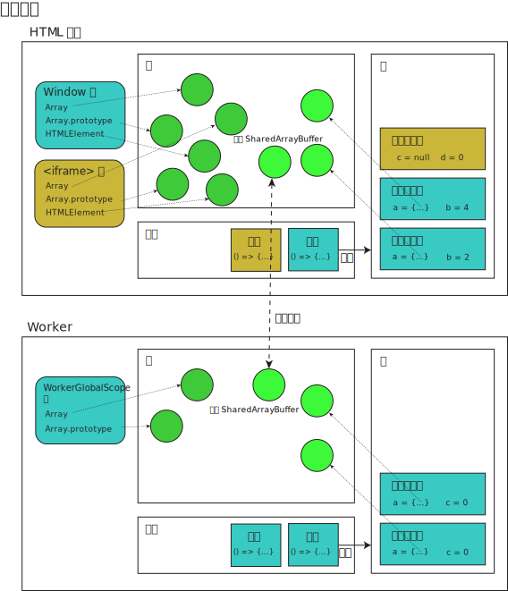

本页介绍 JavaScript 运行时环境的基本架构。该模型主要是理论性的、抽象的，没有任何特定平台或特定实现的细节。现代 JavaScript 引擎对所描述的语义进行了大量优化。

本页仅供参考。它假定你已经熟悉其他编程语言（如 C 和 Java）的执行模型。它大量引用了操作系统和编程语言中的现有概念。

## 引擎和宿主

JavaScript 的执行需要两个软件的配合：**JavaScript 引擎**和**宿主环境**。

JavaScript 引擎实现了 [ECMAScript（JavaScript）语言](/zh-CN/docs/Web/JavaScript/Reference/JavaScript_technologies_overview#javascript_核心语言（ecmascript）)，提供了核心功能。它接收源代码，对其进行解析并执行。但是，为了与外部世界交互，例如产生任何有意义的输出、与外部资源接口，或实现与安全或性能相关的机制，我们需要由宿主环境提供额外的特定环境机制。例如，在 web 浏览器中执行 JavaScript 时，HTML DOM 就是宿主环境。Node.js 是另一种允许 JavaScript 在服务器端运行的宿主环境。

虽然我们在本参考文献中主要关注的是 ECMAScript 中定义的机制，但我们偶尔也会讨论 HTML 规范中定义的机制，这些机制通常会被 Node.js 或 Deno 等其他宿主环境所模仿。这样，我们就能对 web 及其他环境中使用的 JavaScript 执行模型给出一个连贯的描述。

## 代理执行模型

在 JavaScript 规范中，JavaScript 的每个自主执行器都被称为**代理**，它维护着自己的代码执行设施：

- （对象）**堆**：这只是一个名称，用来表示内存中的一个大区域（大多是非结构化的）。当程序中创建对象时，它就会被填充。请注意，在共享内存的情况下，每个代理都有自己的堆，每个堆都有自己版本的 {{jsxref("SharedArrayBuffer")}} 对象，但缓冲区所代表的底层内存是共享的。
- [（作业）**队列**](#作业队列和事件循环)：这在 HTML 中（通常）被称为事件循环（_event loop_），它可以在 JavaScript 中实现异步编程，同时又是单线程的。之所以称其为队列，是因为它通常是先入先出：先执行的工作在后执行的工作之前。
- [（执行上下文）**栈**](#栈与执行上下文)：这就是所谓的调用栈（_call stack_），允许通过进入和退出执行上下文（如函数）来传输控制流。之所以称为栈，是因为它是后进先出的。每个任务进入时都会向（空）栈中推入一个新帧，退出时则会清空栈。

这是三种不同的数据结构，用于跟踪不同的数据。我们将在下面的章节中详细介绍队列和堆栈。要了解堆内存如何分配和释放，请参阅[内存管理](/zh-CN/docs/Web/JavaScript/Guide/Memory_management)。

每个代理都类似于一个线程（注意，底层实现可能是也可能不是实际的操作系统线程）。每个代理可以拥有多个[域](#域)（与全局对象一一对应），这些代理可以同步访问彼此，因此需要在单个执行线程中运行。一个代理也有一个单一的内存模型，表明它是否是小端序的、是否可以[同步阻塞](#并发性与确保进展)、原子操作是否[无锁](/zh-CN/docs/Web/JavaScript/Reference/Global_Objects/Atomics/isLockFree)等。

web 上的代理可以是以下之一：

- 一个包含各种 {{domxref("Window")}} 对象的*相似源 window 代理*，这些对象有可能直接或通过使用 {{domxref("Document/domain", "document.domain")}} 相互联系。如果窗口[按源成键](/zh-CN/docs/Web/API/Window/originAgentCluster)，则只有同源窗口才能相互联系。
- 一个包含 {{domxref("DedicatedWorkerGlobalScope")}} 的*专用 Worker 代理*。
- 一个包含 {{domxref("SharedWorkerGlobalScope")}} 的*共享 Worker 代理*。
- 一个包含 {{domxref("ServiceWorkerGlobalScope")}} 的 _Service worker 代理_。
- 一个包含 {{domxref("WorkletGlobalScope")}} 的 _Worklet 代理_。

换句话说，每个 Worker 创建自己的代理，而一个或多个窗口可能在同一个代理中，通常是一个主文档及其类似的源 iframe。在 Node.js 中，也有一个类似的概念，称为 [worker 线程](https://nodejs.org/api/worker_threads.html)。

下图说明了代理的执行模式：



## 域

每个代理都拥有一个或多个**域**（realm）。每一段 JavaScript 代码在加载时都会与一个域相关联，即使从另一个领域调用也不会改变。域由以下信息组成：

- 固有对象列表，如 `Array`、`Array.prototype` 等。
- 全局声明的变量、[`globalThis`](/zh-CN/docs/Web/JavaScript/Reference/Global_Objects/globalThis) 的值以及全局对象。
- [模板字面数组](/zh-CN/docs/Web/JavaScript/Reference/Template_literals#带标签的模板)的缓存，因为对同一标记的模板字面表达式的求值总是会导致标记接收到相同的数组对象。

在 web 上，域和全局对象是一一对应的。全局对象可以是 {{domxref("Window")}}、{{domxref("WorkerGlobalScope")}} 或 {{domxref("WorkletGlobalScope")}}。因此，举例来说，每个 `iframe` 都在不同的域中执行，尽管它可能与父窗口在同一个代理中。

在讨论全局对象的身份时，通常会提到域。例如，我们需要 {{jsxref("Array.isArray()")}} 或 {{jsxref("Error.isError()")}} 这样的方法，因为在另一个域构建的数组的原型对象与当前域中的 `Array.prototype` 对象不同，因此 `instanceof Array` 将错误地返回 `false`。

## 栈与执行上下文

我们首先考虑同步代码执行。每个[作业](#作业队列与事件循环)通过调用相关的回调进入。回调中的代码可以创建变量、调用函数或退出。每个函数都需要跟踪自己的变量环境和返回位置。为此，代理需要一个堆栈来跟踪执行上下文。**执行上下文**一般也称为*栈帧*，是执行的最小单位。它跟踪以下信息：

- 代码评估状态；
- 包含此代码的模块或脚本、函数（如适用）以及当前执行的[生成器](/zh-CN/docs/Web/JavaScript/Reference/Global_Objects/Generator)；
- 当前的[域](#域)；
- [绑定](/zh-CN/docs/Glossary/Binding)，包括：
  - 用 `var`、`let`、`const`、`function`、`class` 等定义的变量；
  - 私有标识符，如 `#foo`，仅在当前上下文中有效；
  - `this` 引用；

试想一下，一个程序由以下代码定义的单个作业组成：

```js
function foo(b) {
  const a = 10;
  return a + b + 11;
}

function bar(x) {
  const y = 3;
  return foo(x * y);
}

const baz = bar(7); // 将 42 赋值给 baz
```

1. 任务启动时，会创建第一个栈帧，其中定义了变量 `foo`、`bar` 和 `baz`。它使用参数 `7` 调用 `bar`。
2. 为 `bar` 调用创建第二个栈帧，其中包含参数 `x` 和局部变量 `y` 的绑定。它首先执行乘法运算 `x * y`，然后使用结果调用 `foo`。
3. 为 `foo` 调用创建第三个栈帧，其中包含参数 `b` 和局部变量 `a` 的绑定。它首先执行加法运算 `a + b + 11`，然后返回结果。
4. 当 `foo` 返回时，最上面的帧元素从堆栈中弹出，调用表达式 `foo(x * y)` 解析为返回值。然后继续执行，也就是返回这个结果。
5. 当 `bar` 返回时，最上面的帧元素从堆栈中弹出，调用表达式 `bar(7)` 解析为返回值。这样就用返回值初始化了 `baz`。
6. 我们到达了作业源代码的末尾，因此入口点的栈帧被从堆栈中弹出。堆栈为空，因此作业被视为已完成。

### 生成器与重入

栈帧弹出后，并不一定会永远消失，因为有时我们需要返回到它。例如，考虑一个生成器函数：

```js
function* gen() {
  console.log(1);
  yield;
  console.log(2);
}

const g = gen();
g.next(); // 输出 1
g.next(); // 输出 2
```

在这种情况下，调用 `gen()` 首先会创建一个挂起的执行上下文——`gen` 内部的代码不会被执行。生成器 `g` 会在内部保存这个执行上下文。当前正在运行的执行上下文仍然是入口点。调用 `g.next()` 时，`gen` 的执行上下文会被推入堆栈，`gen` 内部的代码会一直执行到 `yield` 表达式。然后，生成器的执行上下文被挂起并从堆栈中移除，控制权返回入口点。再次调用 `g.next()` 时，生成器的执行上下文会被推回堆栈，`gen` 内部的代码会从上次中断的地方继续执行。

### 尾调用

规范中定义的一种机制是*正确的尾调用*（proper tail call，PTC）。如果调用者在调用后除了返回值外什么也不做，那么该函数调用就是尾部调用：

```js
function f() {
  return g();
}
```

在这种情况下，对 `g` 的调用是尾调用。如果函数调用处于尾部位置，引擎需要丢弃当前的执行上下文，代之以尾部调用的上下文，而不是为 `g()` 调用推送一个新帧。这意味着尾递归不受堆栈大小的限制：

```js
function factorial(n, acc = 1) {
  if (n <= 1) return acc;
  return factorial(n - 1, n * acc);
}
```

实际上，丢弃当前帧会导致调试问题，因为如果 `g()` 引发错误，`f` 就不再在堆栈上，也不会出现在堆栈跟踪中。目前，只有 Safari（JavaScriptCore）实现了 PTC，而且他们还发明了一些[特定基础设施](https://webkit.org/blog/6240/ecmascript-6-proper-tail-calls-in-webkit/)来解决调试问题。

### 闭包

与变量范围和函数调用相关的另一个有趣现象是[闭包](/zh-CN/docs/Web/JavaScript/Guide/Closures)。每当创建一个函数时，它也会在内部记忆当前运行的执行上下文的变量绑定。这样，这些变量绑定就可以超越执行上下文。

```js
let f;
{
  let x = 10;
  f = () => x;
}
console.log(f()); // 输出 10
```

### 作业队列与事件循环

单个代理是一个线程，这意味着解释器一次只能处理一条语句。当代码都是同步的时候，这没有问题，因为我们总是能取得进展。但如果代码需要执行异步操作，那么除非该操作完成，否则我们就无法取得进展。但是，如果整个程序因此而停止，就会影响用户体验——JavaScript 作为 web 脚本语言的特性要求它[永不阻塞](#永不阻塞)。因此，处理异步操作完成的代码被定义为回调。该回调定义了一个**任务**，一旦动作完成，该任务就会被放入一个**任务队列**，或者用 HTML 术语来说，一个事件循环。

每次，代理都会从队列中拉出一个作业并执行它。作业执行完毕后，可能会创建更多作业，这些作业会被添加到队列的末尾。也可以通过完成异步平台机制（如计时器、I/O 和事件）来添加作业。当[栈](#栈与执行上下文)为空时，作业被视为已完成；然后，下一个作业会从队列中拉出。作业可能不会以统一的优先级被拉出——例如，HTML 事件循环会将作业分成两类：*任务*和*微任务*。微任务具有更高的优先级，在任务队列被拉出之前，微任务队列会先被排空。有关详细信息，请查阅 [HTML 微任务指南](/zh-CN/docs/Web/API/HTML_DOM_API/Microtask_guide)。如果任务队列为空，代理将等待更多任务的添加。

### “运行至完毕”

每个作业都会在处理其他作业之前被完全处理。这在推理程序时提供了一些很好的特性，包括无论函数何时运行，它都不会被抢占，并且会在任何其他代码运行之前完全运行（并且可以修改函数操作的数据）。这与 C 语言不同，例如，如果函数在一个线程中运行，运行时系统可能会在任何时候停止该函数，以便在另一个线程中运行其他代码。

例如，考虑这个示例：

```js
const promise = Promise.resolve();
let i = 0;
promise.then(() => {
  i += 1;
  console.log(i);
});
promise.then(() => {
  i += 1;
  console.log(i);
});
```

在本例中，我们创建了一个已解决的 promise，这意味着附加到该 promise 上的任何回调都会被立即调度为作业。这两个回调似乎会导致条件竞争，但实际上，输出是完全可预测的：将依次输出 `1` 和 `2`。这是因为每个作业都会在下一个作业执行之前运行完成，所以总的顺序总是 `i += 1; console.log(i); i += 1; console.log(i);`，而绝不会是 `i += 1; i += 1; console.log(i); console.log(i);`。

这种模式的一个缺点是，如果作业完成时间过长，web 应用程序就无法处理点击或滚动等用户交互。浏览器通过“脚本运行时间过长”对话框来缓解这一问题。一个好的做法是缩短作业处理时间，并尽可能将一个作业分解为多个作业。

### 永不阻塞

事件循环模型提供的另一个重要保证是 JavaScript 的执行永远不会阻塞。处理 I/O 通常是通过事件和回调来执行的，因此当应用程序在等待 [IndexedDB](/zh-CN/docs/Web/API/IndexedDB_API) 查询返回或 [`fetch()`](/zh-CN/docs/Web/API/Window/fetch) 请求返回时，它仍然可以处理用户输入等其他事情。异步操作完成后执行的代码总是以回调函数的形式提供（例如，promise {{jsxref("Promise/then", "then()")}} 处理程序、`setTimeout()` 中的回调函数或事件处理程序），它定义了操作完成后添加到作业队列中的作业。

当然，“永不阻塞”的保证要求平台 API 本身必须是异步的，但也存在一些传统的例外情况，如 `alert()` 或同步 XHR。为了确保应用程序的响应速度，避免使用这些例外情况是一种很好的做法。

## 代理集群与内存共享

多个代理可以通过共享内存进行通信，形成一个**代理集群**。当且仅当代理可以共享内存时，它们才属于同一个集群。两个代理集群没有交换任何信息的内置机制，因此它们可以被视为完全孤立的执行模型。

在创建代理时（例如通过生成 Worker），有一些标准来决定它是与当前代理在同一个集群中，还是创建一个新的集群。例如，以下几对全局对象都在同一个代理集群中，因此可以相互共享内存：

- `Window` 对象及其创建的专用 Worker。
- 一个 Worker（任何类型）及其创建的一个专用 Worker。
- `Window` 对象 A 和 A 创建的同源 `iframe` 元素的 `Window` 对象。
- 一个 `Window` 对象和打开它的同源 `Window` 对象。
- 一个 `Window` 对象及其创建的一个 worklet。

以下几对全局对象不在同一个代理集群内，因此不能共享内存：

- `Window` 对象及其创建的共享 Worker。
- 一个 Worker（任何类型）及其创建的共享 Worker。
- `Window` 对象及其创建的 service worker。
- `Window` 对象 A 和 A 创建的 `iframe` 元素的 `Window` 对象，该元素不能与 A 属于同源域。
- 任何两个没有打开者或祖先关系的 `Window` 对象。即使这两个 `Window` 对象是同源域，也是如此。

具体算法可以参阅 [HTML 规范](https://html.spec.whatwg.org/multipage/webappapis.html#integration-with-the-javascript-agent-cluster-formalism)。

### 跨代理交流与内存模型

如前所述，代理通过共享内存进行通信。在网络上，内存是通过 [`postMessage()`](/zh-CN/docs/Web/API/Window/postMessage) 方法共享的。[使用 web worker](/zh-CN/docs/Web/API/Web_Workers_API/Using_web_workers) 指南对此进行了概述。通常情况下，数据只按值传递（通过[结构化克隆](/zh-CN/docs/Web/API/Web_Workers_API/Structured_clone_algorithm)），因此不涉及任何并发复杂性。要共享内存，必须发布一个 {{jsxref("SharedArrayBuffer")}} 对象，多个代理可以同时访问该对象。两个代理通过 `SharedArrayBuffer` 共享同一内存后，就可以通过 {{jsxref("Atomics")}} 对象同步执行。

访问共享内存有两种方式：普通内存访问（非原子访问）和原子内存访问。后者是[顺序一致的](https://en.wikipedia.org/wiki/Sequential_consistency)（这意味着集群中的所有代理都同意对事件进行严格的总排序），而前者是无序的（这意味着不存在排序）。JavaScript 不提供具有其他排序保证的操作。

该规范为使用共享内存的程序员提供了以下指导：

> 我们建议程序保持无数据竞争，即在同一内存位置上不可能有并发的非原子操作。无数据竞争程序具有交错语义，每个代理的每一步评估语义都是相互交错的。对于无数据竞争的程序，无需了解内存模型的细节。这些细节不太可能建立起有助于更好地编写 ECMAScript 的直觉。
>
> 更一般地说，即使程序不存在数据竞争，只要原子操作不涉及任何数据竞争，并且竞争操作的访问大小相同，那么程序就可能具有可预测的行为。要使原子操作不参与竞争，最简单的方法就是确保原子操作和非原子操作使用不同的内存单元，而且不同大小的原子访问不能同时用于访问相同的单元。实际上，程序应尽可能将共享内存视为强类型内存。虽然我们仍然不能依赖于非原子访问的排序和时间，但如果内存被视为强类型，那么竞争访问就不会“撕裂”（其值的位数不会混合）。

### 并发性与确保进展

当多个代理合作时，[永不阻塞](#永不阻塞)保证并不总是成立的。一个代理在等待另一个代理执行某些操作时，可能会被*阻塞*或暂停。这不同于在同一代理中等待一个 promise，因为它会使整个代理停止，并且不允许任何其他代码在此期间运行，换句话说，它无法取得*进展*。

为防止出现死锁，对何时以及哪些代理会被阻塞有一些严格的限制。

- 每个拥有专用执行线程的未受阻代理最终都会取得进展。
- 在一组共享执行线程的代理中，最终会有一个代理取得进展。
- 除非通过提供阻塞功能的显式应用程序接口，否则一个代理不会导致另一个代理被阻塞。
- 只有某些代理可以被阻塞。在 web 上，这包括专用 Worker 和共享 Worker，但不包括相似源窗口或 service worker。

在外部暂停或终止的情况下，代理集群可确保其代理活动具有一定程度的完整性：

- 代理可能会在不知情或不配合的情况下被暂停或恢复。例如，导航离开窗口可能会暂停代码执行，但会保留其状态。但是，不允许部分停用代理集群，以避免代理因其他代理被停用而陷入饥饿状态。例如，共享工作者永远不会与创建者窗口或其他专用工作者在同一个代理集群中。这是因为共享工作者的生命周期与文档无关：如果文档在其专用 worker 持有锁的情况下被停用，那么共享 worker 将被阻止获取锁，直到专用 worker 被重新激活为止（如果有的话）。与此同时，试图从其他窗口访问共享 worker 的其他 worker 将处于饥饿状态。
- 同样，代理也可能因集群外部因素而终止。例如，操作系统或用户杀死浏览器进程，或浏览器因使用过多资源而强制终止一个代理。在这种情况下，集群中的所有代理都会被终止。（规范还允许第二种策略，即通过 API，允许集群中至少一个剩余成员识别终止情况和被终止的代理，但这并没有在 web 上实现）。

## 规范

{{Specifications}}

## 参见

- HTML 规范中的[事件循环](https://html.spec.whatwg.org/multipage/webappapis.html#event-loops)
- Node.js 文档中的[什么是事件循环？](https://nodejs.org/en/learn/asynchronous-work/event-loop-timers-and-nexttick#what-is-the-event-loop)
