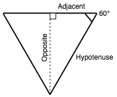

**`Math`** 命名空间对象包含用于数学常量和函数的静态属性与方法。

`Math` 用于 {{jsxref("Number")}} 类型。它不支持 {{jsxref("BigInt")}}。

## 描述

与其他全局对象不同的是，`Math` 不是一个构造函数，不可以与 [`new` 运算符](/zh-CN/docs/Web/JavaScript/Reference/Operators/new)同时使用，也不可以将 `Math` 对象作为函数调用。`Math` 的所有属性与方法都是静态的。

> [!NOTE]
> `Math` 的许多函数的精度是*取决于具体实现的*。
>
> 这意味着不同浏览器可能会给出不同的结果。即使是同一款 JavaScript 引擎，在不同的操作系统或架构上运行时，也可能产生不同的结果！

## 静态属性

- {{jsxref("Math.E")}}
  - : 欧拉数，即自然对数的底数，约等于 `2.718`。
- {{jsxref("Math.LN10")}}
  - : `10` 的自然对数，约等于 `2.303`。
- {{jsxref("Math.LN2")}}
  - : `2` 的自然对数，约等于 `0.693`。
- {{jsxref("Math.LOG10E")}}
  - : 以 10 为底的 `E` 的对数，约等于 `0.434`。
- {{jsxref("Math.LOG2E")}}
  - : 以 2 为底的 `E` 的对数，约等于 `1.443`。
- {{jsxref("Math.PI")}}
  - : 一个圆的周长和直径之比，约等于 `3.14159`。
- {{jsxref("Math.SQRT1_2")}}
  - : ½（二分之一）的平方根，约等于 `0.707`。
- {{jsxref("Math.SQRT2")}}
  - : `2` 的平方根，约等于 `1.414`。
- `Math[Symbol.toStringTag]`
  - : [`[Symbol.toStringTag]`](/zh-CN/docs/Web/JavaScript/Reference/Global_Objects/Symbol/toStringTag) 属性的初始值为字符串 `"Math"`。该属性使用于 {{jsxref("Object.prototype.toString()")}}。

## 静态方法

- {{jsxref("Math.abs()")}}
  - : 返回一个数的绝对值。
- {{jsxref("Math.acos()")}}
  - : 返回一个数的反余弦值。
- {{jsxref("Math.acosh()")}}
  - : 返回一个数的反双曲余弦值。
- {{jsxref("Math.asin()")}}
  - : 返回一个数的反正弦值。
- {{jsxref("Math.asinh()")}}
  - : 返回一个数的反双曲正弦值。
- {{jsxref("Math.atan()")}}
  - : 返回一个数的反正切值。
- {{jsxref("Math.atan2()")}}
  - : 返回其两个参数之商的反正切值。
- {{jsxref("Math.atanh()")}}
  - : 返回一个数的反双曲正切值。
- {{jsxref("Math.cbrt()")}}
  - : 返回一个数的立方根。
- {{jsxref("Math.ceil()")}}
  - : 返回大于等于一个数的最小整数。
- {{jsxref("Math.clz32()")}}
  - : 返回一个 32 位整数的前导零的数量。
- {{jsxref("Math.cos()")}}
  - : 返回一个数的余弦值。
- {{jsxref("Math.cosh()")}}
  - : 返回一个数的双曲余弦值。
- {{jsxref("Math.exp()")}}
  - : 返回 e<sup>x</sup>，其中 `x` 为参数，`e` 是欧拉常数（`2.718`...，自然对数的底数）。
- {{jsxref("Math.expm1()")}}
  - : 返回 `exp(x) - 1` 的值。
- {{jsxref("Math.floor()")}}
  - : 返回小于等于一个数的最大整数。
- {{jsxref("Math.f16round()")}}
  - : 返回最接近一个数的[半精度浮点型](https://zh.wikipedia.org/wiki/半精度浮点数)表示。
- {{jsxref("Math.fround()")}}
  - : 返回最接近一个数的[单精度浮点型](https://zh.wikipedia.org/wiki/單精度浮點數)表示。
- {{jsxref("Math.hypot()")}}
  - : 返回其所有参数平方和的平方根。
- {{jsxref("Math.imul()")}}
  - : 返回 32 位整数乘法的结果。
- {{jsxref("Math.log()")}}
  - : 返回一个数的自然对数（㏒<sub>e</sub>，即 ㏑）。
- {{jsxref("Math.log10()")}}
  - : 返回一个数以 10 为底数的对数。
- {{jsxref("Math.log1p()")}}
  - : 返回 `1 + x` 的和的 `x` 的自然对数（㏒<sub>e</sub>，即 ㏑）。
- {{jsxref("Math.log2()")}}}
  - : 返回一个数以 2 为底数的对数。
- {{jsxref("Math.max()")}}
  - : 返回零到多个数值中最大值。
- {{jsxref("Math.min()")}}
  - : 返回零到多个数值中最小值。
- {{jsxref("Math.pow()")}}
  - : 返回 `x` 的 y 次幂（也就是 `x`<sup><code>y</code></sup>）。
- {{jsxref("Math.random()")}}
  - : 返回一个 `0` 到 `1` 之间的伪随机数。
- {{jsxref("Math.round()")}}
  - : 返回四舍五入后的整数。
- {{jsxref("Math.sign()")}}
  - : 返回一个数的符号，表示它是正数、负数还是 0。
- {{jsxref("Math.sin()")}}
  - : 返回一个数的正弦值。
- {{jsxref("Math.sinh()")}}
  - : 返回一个数的双曲正弦值。
- {{jsxref("Math.sqrt()")}}
  - : 返回一个数的平方根。
- {{jsxref("Math.sumPrecise()")}}
  - : 返回传入的可迭代数字集合的和，同时避免中间结果出现浮点精度损失。
- {{jsxref("Math.tan()")}}
  - : 返回一个数的正切值。
- {{jsxref("Math.tanh()")}}
  - : 返回一个数的双曲正切值。
- {{jsxref("Math.trunc()")}}
  - : 返回一个数的整数部分，直接去除其小数点及之后的部分。

## 示例

### 在角度与弧度之间转换

三角函数 `sin()`、`cos()`、`tan()`、`asin()`、`acos()`、`atan()` 和 `atan2()` 期望（并返回）以*弧度*为单位的角。

由于人们习惯以角度为单位进行思考，且某些函数（如 CSS 变换）可以接受角度为单位，因此准备一些用于在两种单位之间进行转换的函数是个好主意：

```js
function degToRad(degrees) {
  return degrees * (Math.PI / 180);
}

function radToDeg(rad) {
  return rad / (Math.PI / 180);
}
```

### 计算等边三角形的高

如果我们要计算等边三角形的高，且已知其边长为 100，我们可以使用公式：_邻边的长度乘以该角的正切等于对边的长度_。



在 JavaScript 中，我们可以这样实现：

```js
50 * Math.tan(degToRad(60));
```

我们使用 `degToRad()` 函数将 60 度转换为弧度，因为 {{jsxref("Math.tan()")}} 期望输入值以弧度为单位。

### 返回两端之间的随机整数

可以使用 {{jsxref("Math.random()")}} 和 {{jsxref("Math.floor()")}} 组合实现：

```js
function random(min, max) {
  const num = Math.floor(Math.random() * (max - min + 1)) + min;
  return num;
}

random(1, 10);
```

## 规范

{{Specifications}}

## 浏览器兼容性

{{Compat}}

## 参见

- {{jsxref("Number")}}
