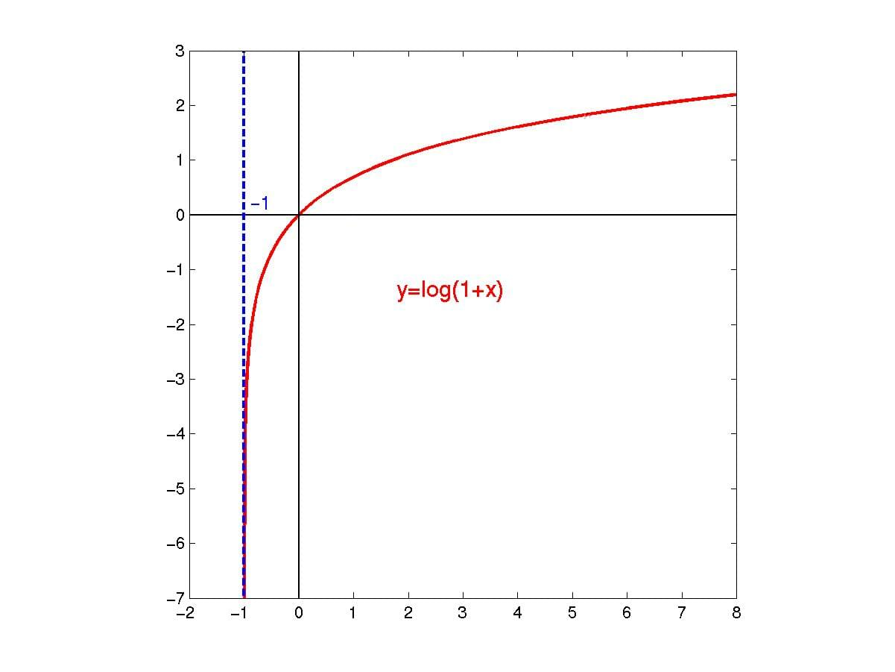

{{JSRef("Global_Objects", "Math")}}

## 概述

**`Math.log1p()`** 函数返回一个数字加 1 后的自然对数 (底为 `E`), 既`log(x+1)`.

## 语法

```plain
Math.log1p(x)
```

### 参数

- `x`
  - : 任意数字。

## 描述

如果参数的值小于`-1`, 则返回 `NaN.`

函数 `y = log(x+1)` 的图形是这样的：



**示例**

```js
Math.log1p(Math.E - 1); // 1
Math.log1p(0); // 0
Math.log1p("0"); // 0
Math.log1p(-1); // -Infinity
Math.log1p(-2); // NaN
Math.log1p("foo"); // NaN
```

## 规范

{{Specifications}}

## 浏览器兼容性

{{Compat}}

## 相关链接

- {{jsxref("Global_Objects/Math", "Math")}} 对象。
