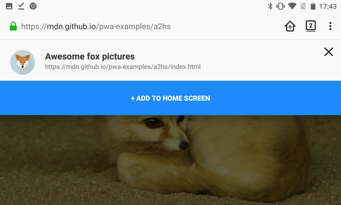

添加到主屏幕（Add to Home Screen，简称 A2HS）是现代智能手机浏览器中的一项功能，使开发人员可以轻松便捷地将自己喜欢的 Web 应用程序（或网站）的快捷方式添加到主屏幕中，以便用户随后可以通过单击访问它。本指南说明了 A2HS 的使用方式，以及作为开发人员为使用户能利用 A2HS 所需做的事情。

## 为什么选择 A2HS？

A2HS 被认为是渐进式 [Web 应用程序](/zh-CN/docs/Web/Progressive_web_apps)哲学的一部分——为 Web 应用程序提供与原生应用程序相同的用户体验优势，因此它们可以在当今的生态系统战争中竞争。这部分是通过访问主屏幕上的应用程序图标来访问应用程序，然后将其整齐地显示在自己的窗口中的简单手势。A2HS 使这成为可能。

## 哪些浏览器支持 A2HS？

Mobile Chrome / Android Webview 从 31 版开始支持 A2HS，Opera for Android 从 32 版开始支持，Firefox for Android 从 [58 版](/zh-CN/docs/Mozilla/Firefox/Releases/58) 开始支持。

## 如何使用？

我们已经编写了一个非常简单的示例网站（[观看我们的在线演示](https://mdn.github.io/pwa-examples/a2hs/)，并[查看源代码](https://github.com/mdn/pwa-examples/tree/main/a2hs)），该网站虽然功能不多，但是实现 A2HS 所必须的代码都有包含，Service Worker 也使其可以脱机使用。这个示例展示了一系列的狐狸图片。

如果您有适用于 Android 的 Firefox，使用它打开我们的示例：`https://mdn.github.io/pwa-examples/a2hs/`。你将会看到狐狸图片，但更重要的是，你将会看到一个带有加号（+）的“主页”图标——这是为具有必要功能的任何站点显示的“添加到主屏幕”图标。


点击此按钮将显示一个确认横幅，按下大大的“添加到主屏幕”按钮即可将应用添加到主屏幕。（注意：在 Android 8 及更高版本中，将首先显示系统级的“添加到主屏幕”权限对话框。）



使用 Mobile Chrome 的体验则略有不同；加载我们的网站后，您会看到一个弹出安装横幅，询问您是否要将此应用添加到主屏幕。


> **备注：** 您可以在“[Web App 安装横幅](https://developers.google.com/web/fundamentals/app-install-banners/)”一文中找到有关 Chrome 安装横幅的更多信息。

如果您选择不将其添加到主屏幕，则可以稍后使用 Chrome 主菜单中的添加到主屏幕图标添加。

无论使用哪种浏览器，当您选择将应用程序添加到主屏幕时，您都会看到它与短标题一起出现，就像原生应用程序一样。


点按此图标可以将其打开，但是作为全屏应用程序，您将不再看到其周围的浏览器用户界面。

## 如何使应用程序支持 A2HS？

要将您的应用添加到主屏幕，它需要满足以下条件：

- 应用通过 HTTPS 提供服务——Web 正朝着更加安全的方向发展，包括 A2HS 在内的许多现代 Web 技术都将仅工作在安全的环境中。
- 从 HTML 头链接具有正确字段的 manifest 文件。
- 有合适的图标可显示在主屏幕上。
- Chrome 浏览器还要求该应用程序注册一个 Service Worker（这样在离线状态下就也可以运行）。

### Manifest

Web manifest 以标准 JSON 格式编写，应放置在应用程序目录中的某个位置（最好是在根目录中），名称为 `somefilename.webmanifest`（这里我们将其命名为 `manifest.webmanifest`）。它包含多个字段，这些字段定义有关 Web 应用程序及其行为的某些信息。

> **备注：** .webmanifest 扩展名是在规范的“[媒体类型注册](https://w3c.github.io/manifest/#media-type-registration)”部分中指定的，但通常浏览器也支持带有其他适当扩展名的清单，例如 .json。

A2HS 所需的字段如下：

- `background_color`：指定在某些应用程序上下文中使用的背景色。与 A2HS 最相关的一个是在点击主屏幕上的应用程序图标并首次开始加载时显示的初始屏幕（目前仅在通过 Chrome 将应用添加到主屏幕时显示）。
- `display`：指定应如何显示应用。为了使它看起来像一个应用程序而非网页，这里应该填写像是 `fullscreen` （根本不显示任何 UI）或 `standalone`（与前者非常相似，但是状态栏这样的系统级 UI 元素可能是可见的）的值。
- `icons`：指定在不同位置（例如，在任务切换器上或更重要的是在主屏幕上）表示应用程序时浏览器使用的图标。我们的演示中仅包含一个。
- `name`/`short_name`：这些字段提供了在不同位置表示应用程序时要显示的应用程序名称。`name` 提供完整的应用名称。`short_name` 则是当没有足够的空间显示全名时，提供的缩写名称。如果您的应用程序名称特别长，建议您同时提供两者。
- `start_url`：提供启动添加到主屏幕应用程序时应加载的资源的路径。请注意，这必须是一个相对 manifest 指向网站主页的相对路径。另请注意，Chrome 需要这条字段才能显示安装标语，而 Firefox 即使没有这条字段也会显示用于添加到主屏的含加号的主页图标。

我们的示例应用程序的 manifest 如下所示：

```js
{
  "background_color": "purple",
  "description": "Shows random fox pictures. Hey, at least it isn't cats.",
  "display": "fullscreen",
  "icons": [
    {
      "src": "icon/fox-icon.png",
      "sizes": "192x192",
      "type": "image/png"
    }
  ],
  "name": "Awesome fox pictures",
  "short_name": "Foxes",
  "start_url": "/pwa-examples/a2hs/index.html"
}
```

### 合适的图标

如以上 manifest 所示，我们包括一个 192 x 192 像素的图标，供我们的应用使用。您可以根据需要添加更多尺寸；Android 将为每个不同的用例选择最合适的尺寸。您还可以决定添加不同类型的图标，以便设备可以使用他们能够使用的最佳图标（例如，Chrome 已经支持 WebP 格式）。

请注意，每个图标对象中的 `type` 成员都指定了该图标的 MIME 类型，因此浏览器可以快速读取该图标的类型，并在不支持此类型时将其忽略并采用其他图标。

在设计图标方面，您应该遵循与任何 Android 图标相同的最佳做法（请参阅 [Google Play 图标设计规范](https://developer.android.google.cn/distribute/google-play/resources/icon-design-specifications)）。

### 将 HTML 链接到 manifest

要完成 manifest 的设置，您需要从应用程序主页的 HTML 中引用它：

```html
<link rel="manifest" href="manifest.webmanifest" />
```

一旦有了 manifest 声明，支持 A2HS 的浏览器就会知道在哪里查找它。

## A2HS 不提供什么？

请记住，将应用程序添加到主屏幕时，它只会使该应用程序易于访问，而不会将应用程序的资料和数据下载到您的设备上，也不会使该应用程序脱机使用或类似的操作。为了使应用离线运行，你必须使用 [Service Worker API](/zh-CN/docs/Web/API/Service_Worker_API) 来离线存储资源，如果需要，还可以使用 [Web Storage](/zh-CN/docs/Web/API/Web_Storage_API) 或 [IndexedDB](/zh-CN/docs/Web/API/IndexedDB_API) 来存储其数据。

在示例应用程序中，我们仅使用了一个 service worker 来存储所有必需的文件。service worker 使用[`index.js`](https://github.com/mdn/pwa-examples/blob/master/a2hs/index.js) 文件中的最终的代码块在网站上注册。然后，我们使用 [Cache API](/zh-CN/docs/Web/API/Cache) 缓存网站的所有资产，并使用 [sw.js](https://github.com/mdn/pwa-examples/blob/master/a2hs/sw.js) 文件中的代码从缓存而不是网络中为它们提供服务。

## 桌面上的\_A2HS

虽然 PWA 最初旨在改善移动操作系统上的用户体验，但也有人推进在桌面端安装 PWA 的进程。

> **注意：** 在撰写本文时，仅在较新版本的 Chrome 支持以下功能（在 Windows 上默认支持，在 macOS 则需开启 #enable-desktop-pwas 标志）。

### 添加安装按钮

为了使 PWA 可在桌面上安装，我们首先在文档中添加了一个按钮，以允许用户进行安装—桌面应用程序不会自动提供此按钮，并且需要通过用户手势来触发安装：

```html
<button class="add-button">Add to home screen</button>
```

然后，我们给它一些简单的样式：

```css
.add-button {
  position: absolute;
  top: 1px;
  left: 1px;
}
```

### 用于处理安装的\_JavaScript

在 [`index.js` 文件](https://github.com/mdn/pwa-examples/blob/master/a2hs/index.js)的底部，我们添加了一些 JavaScript 代码来处理安装。首先，我们声明一个 `deferredPrompt` 变量（我们将在后面解释），获得对安装按钮的引用，并初始设置为 `display: none`：

```js
let deferredPrompt;
const addBtn = document.querySelector(".add-button");
addBtn.style.display = "none";
```

我们最初隐藏该按钮是因为 PWA 必须满足 A2HS 标准才会安装。条件满足时，支持的浏览器将触发 `beforeinstallprompt` 事件。然后，我们可以使用以下处理程序来处理安装：

```js
window.addEventListener("beforeinstallprompt", (e) => {
  // 防止 Chrome 67 及更早版本自动显示安装提示
  e.preventDefault();
  // 稍后再触发此事件
  deferredPrompt = e;
  // 更新 UI 以提醒用户可以将 App 安装到桌面
  addBtn.style.display = "block";

  addBtn.addEventListener("click", (e) => {
    // 隐藏显示 A2HS 按钮的界面
    addBtn.style.display = "none";
    // 显示安装提示
    deferredPrompt.prompt();
    // 等待用户反馈
    deferredPrompt.userChoice.then((choiceResult) => {
      if (choiceResult.outcome === "accepted") {
        console.log("User accepted the A2HS prompt");
      } else {
        console.log("User dismissed the A2HS prompt");
      }
      deferredPrompt = null;
    });
  });
});
```

所以我们在这里：

- 调用 {{domxref("Event.preventDefault()")}} 以防止 Chrome 67 及更早版本自动调用安装提示（此行为在 Chrome 68 已更改）。
- 将事件对象存储在 `deferredPrompt` 变量中，以便以后可以用于执行实际安装。
- 将按钮设置为 `display: block`，以便它出现在 UI 中供用户点击。
- 设置按钮的 `click` 处理程序。

点击处理程序包含以下步骤：

- 通过 `display: none` 再次隐藏按钮—安装应用程序后将不再需要它。
- 使用 `beforeinstallprompt` 事件对象（存储在 `deferredPrompt` 中）上可用的 `prompt()` 方法触发显示安装提示。
- 使用 `userChoice` 属性响应用户与提示的交互，该属性再次在 `beforeinstallprompt` 事件对象上可用。
- 将 `deferredPrompt` 设置为 null，因为不再需要它。

于是，点击按钮后安装提示就会消失。


如果用户选择安装，则将安装该应用程序（可作为独立的桌面应用程序使用），并且不再显示“安装”按钮（如果已经安装了该应用程序，则将不再触发 `onbeforeinstallprompt` 事件）。当您打开应用程序时，它将显示在其自己的窗口中：


如果用户选择“取消”，则应用程序的状态将返回到单击按钮之前的状态。

> **备注：** 本部分的代码主要来自 Pete LaPage 的[应用安装横幅/添加到主屏幕](https://developers.google.com/web/fundamentals/app-install-banners/)。

## 其他

- [渐进式 Web 应用](/zh-CN/docs/Web/Progressive_web_apps)
- [Service Worker 接口](/zh-CN/docs/Web/API/Service_Worker_API)
- [Web manifest 参考](/zh-CN/docs/Web/Manifest)
- [应用安装横幅](https://developers.google.com/web/fundamentals/app-install-banners/)

{{QuickLinksWithSubpages("/zh-CN/docs/Web/Progressive_web_apps/")}}
